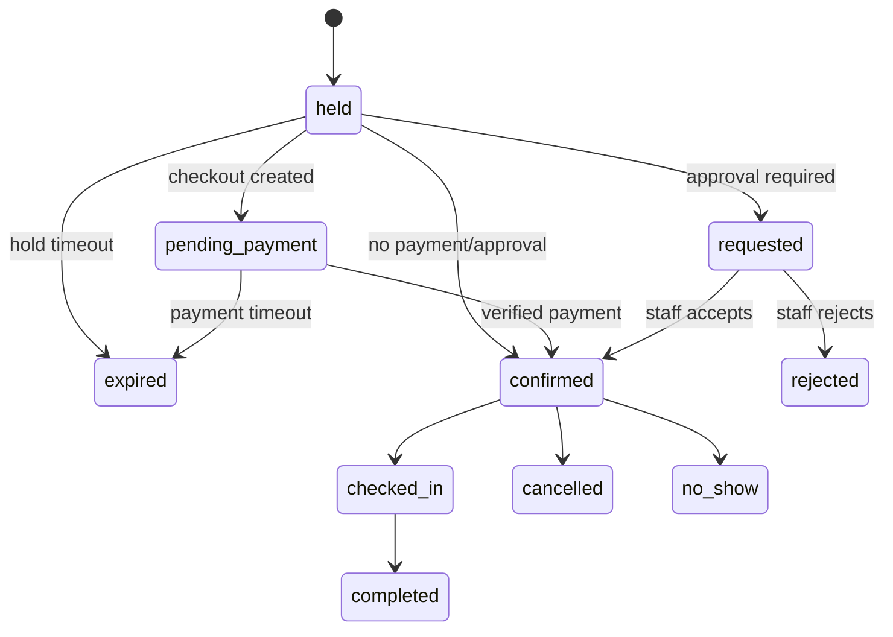
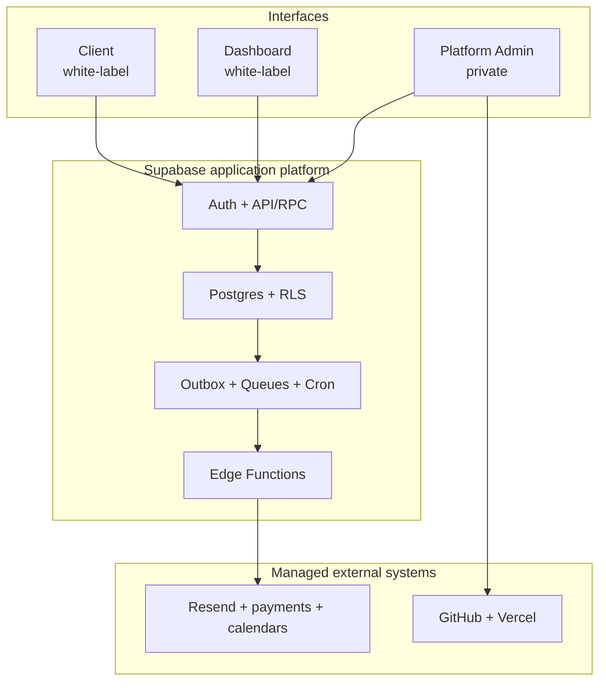
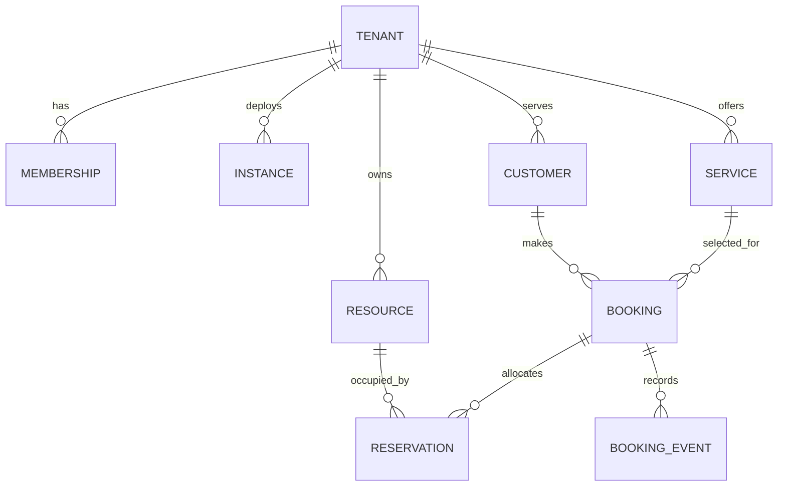

# White-Label Booking Platform

https://claude.ai/code/artifact/9bf89abf-f3ee-4321-8ec6-c981a584c55e protoype

## Complete Product and Architecture Specification

**Status:** Recommended build baseline  
**Research date:** 4 September 2026  
**Primary stack:** Next.js, Supabase, Resend, Vercel, GitHub  
**Audience:** Product, design, engineering, DevOps, security, QA, and AI coding agents

---

## 1. Executive recommendation

Build a multi-tenant booking SaaS with three separate Next.js applications:

1. **Client** — the public, customer-facing booking website.
2. **Dashboard** — the white-labelled staff and tenant-owner workspace.
3. **Platform Admin** — the private control plane used by the platform team to provision, update, monitor, bill, and support every white-label instance.

Only Client and Dashboard are distributed as white-label code. Platform Admin, database migrations, privileged workers, global billing logic, and operational tooling remain in the private source monorepo.

Use one central Supabase production project initially, with `tenant_id` on every tenant-owned row and Row Level Security (RLS) as the non-optional isolation boundary. All booking mutations that allocate time or capacity must run as atomic PostgreSQL functions or transactions; the browser must never implement booking correctness. Supabase explicitly recommends enabling RLS on every exposed table and testing both allowed and denied operations ([Supabase RLS](https://supabase.com/docs/guides/database/postgres/row-level-security)).

Treat customer repositories as **managed logical forks**, not GitHub-native private forks by default. Each instance repository is seeded from a sanitized Client/Dashboard distribution repository and retains an explicit upstream version. A GitHub App opens controlled upgrade pull requests. This avoids the visibility, permission inheritance, and deletion coupling of private fork networks documented by GitHub ([GitHub fork behavior](https://docs.github.com/en/pull-requests/reference/forks)). Native forks are acceptable only when every repository stays inside one trusted organization and that coupling is intentional.

The architecture is deliberately split into three layers:

- **Product kernel:** booking rules, availability, permissions, API contracts, data access, payments, notifications, and shared UI primitives.
- **Instance layer:** brand, content, navigation, feature flags, assets, and explicitly supported extensions.
- **Control plane:** provisioning, repositories, deployments, domains, email-domain verification, plans, versions, health, support access, and global audit.

This is a strong baseline for appointment and service businesses, classes with finite capacity, exclusive resource rentals, and request-to-book workflows. Hotel-style nightly inventory, airline seats, marketplace ticketing, and highly regulated clinical records require different domain models and should not be claimed as first-release capabilities.

---

## 2. Decisions at a glance

| Area                     | Recommendation                                                               | Why                                                         |
| ------------------------ | ---------------------------------------------------------------------------- | ----------------------------------------------------------- |
| Product model            | Multi-tenant SaaS with optional dedicated deployments                        | Central operations with per-brand control                   |
| Frontend                 | Three independent Next.js App Router applications                            | Clear security, release, and navigation boundaries          |
| Backend                  | Supabase Postgres, Auth, Storage, Realtime, Edge Functions, Queues, and Cron | One integrated backend with PostgreSQL correctness          |
| Tenancy                  | Shared schema, shared tables, mandatory `tenant_id`, RLS                     | Lowest initial operational cost with defense in depth       |
| Booking writes           | Atomic database functions/RPCs                                               | Prevent double booking and partial writes                   |
| White-label distribution | Sanitized distribution repository plus managed logical instance repositories | Keeps Platform Admin and privileged code private            |
| Customization            | Config-first, extension points second, core edits exceptional                | Makes upgrades predictable                                  |
| Instance updates         | Versioned releases and bot-created pull requests                             | Reviewable, testable, reversible upgrades                   |
| Database migrations      | Central platform pipeline only                                               | Prevents tenant repositories from damaging a shared backend |
| Email                    | Transactional outbox → Supabase Queue → Edge Function → Resend               | Durable retries and fast booking responses                  |
| Payments                 | Provider adapter; Stripe Connect where supported                             | Avoids locking the product to one country or merchant model |
| Calendar                 | Google/Microsoft provider adapters; asynchronous two-way sync                | External APIs are eventually consistent                     |
| Deployment               | Two Vercel projects per instance, one private Platform Admin project         | Separate domains and blast radii                            |
| Default languages        | English and Arabic, including RTL                                            | White-label and regional readiness                          |
| Accessibility            | WCAG 2.2 AA target                                                           | Usable product and stronger procurement baseline            |
| Production recovery      | PITR for Postgres plus a separate Storage-object backup plan                 | Database backups do not restore deleted Storage objects     |

---

## 3. Product definition

### 3.1 Product statement

The platform lets a business launch a branded booking website and an operational dashboard without building scheduling infrastructure. Customers discover a service, see valid availability, reserve or request a time, pay when required, and manage their booking. Staff configure services, people, resources, schedules, policies, communications, and reporting. The platform team provisions and maintains all instances from one private control plane.

### 3.2 Core terminology

| Term             | Meaning                                                                        |
| ---------------- | ------------------------------------------------------------------------------ |
| Platform         | The SaaS product operated by the platform company                              |
| Tenant           | A business or organization whose data is isolated from all others              |
| Location         | A branch, venue, or service area within a tenant                               |
| Instance         | A deployed Client + Dashboard pair associated with a tenant and brand          |
| Brand            | Visual, content, locale, domain, and communication settings                    |
| Service          | Something customers can book                                                   |
| Resource         | A staff member, room, vehicle, chair, device, or other capacity constraint     |
| Occurrence       | A specific class/event session with fixed start, end, and capacity             |
| Allocation       | The protected reservation of a resource or capacity for a time range           |
| Hold             | A short-lived allocation while checkout is in progress                         |
| Logical fork     | An independently private instance repository seeded from a controlled upstream |
| Upstream version | The white-label release on which an instance is based                          |

Do not treat **tenant**, **brand**, and **instance** as synonyms. One tenant can eventually own multiple brands or regional instances while retaining one operational data set. Keeping these identifiers separate avoids a painful migration later.

### 3.3 Goals

- Launch branded booking experiences quickly.
- Support reliable availability across staff, locations, services, and resources.
- Give tenant teams an efficient daily operating dashboard.
- Make every booking mutation race-safe, auditable, and idempotent.
- Allow significant visual/content customization without permanent code divergence.
- Let the platform team provision and update instances from one control plane.
- Support English and Arabic correctly, including right-to-left layouts.
- Provide a clean path from shared infrastructure to dedicated enterprise isolation.

### 3.4 Explicit non-goals for the first release

- Hotel/property-management inventory with nightly rates and room-type yield rules.
- Airline/transport seat maps.
- General event-ticket marketplace discovery and ticket scanning.
- Native iOS/Android apps.
- Full CRM, accounting, payroll, or workforce management.
- A no-code page builder with arbitrary executable plugins.
- Customer-defined database migrations.
- Storage of clinical records or other specially regulated records without a separate compliance design.

### 3.5 Supported booking modes

| Mode                        | Release                                       | Allocation rule                                   | Example                     |
| --------------------------- | --------------------------------------------- | ------------------------------------------------- | --------------------------- |
| One-to-one appointment      | MVP                                           | One staff/resource cannot overlap                 | Consultation, salon service |
| Exclusive resource booking  | MVP                                           | One resource is exclusively occupied              | Room, court, vehicle        |
| Group occurrence            | Phase 2 unless the first vertical requires it | Atomic capacity decrement up to `capacity`        | Class, workshop             |
| Request to book             | MVP                                           | Tentative request; staff accepts/rejects          | Site visit, custom service  |
| Multi-resource service      | Phase 2                                       | All required resources allocated atomically       | Staff + room + equipment    |
| Recurring series            | Phase 2                                       | Each occurrence validated; partial-failure policy | Weekly lessons              |
| Waitlist                    | Phase 2                                       | Ordered promotion with expiry window              | Full class                  |
| Multi-day/nightly inventory | Separate product module                       | Date-bucket inventory and pricing                 | Hotel stay                  |

The core should be extensible, but MVP acceptance testing should cover only the modes explicitly sold.

---

## 4. Users, roles, and permissions

### 4.1 Personas

- **Customer:** browses and manages their own bookings.
- **Staff member:** sees assigned work, customer context, and operational actions.
- **Scheduler/front desk:** manages bookings across staff and resources.
- **Location manager:** manages one or more assigned locations.
- **Tenant administrator:** owns configuration, staff access, brand, policies, integrations, and reports.
- **Tenant billing administrator:** manages the tenant’s SaaS plan and invoices, but not necessarily customer payments.
- **Platform support operator:** diagnoses tenant issues through audited, time-limited access.
- **Platform operations administrator:** provisions infrastructure, domains, releases, and incidents.
- **Platform super administrator:** rare break-glass role for global configuration and security operations.

### 4.2 Recommended authorization model

Use a `memberships` table linking `auth.users` to tenants and roles. Resolve permissions from current database state, not only long-lived JWT claims, because owners must be able to revoke a staff member immediately. JWTs identify the user; RLS and server-side authorization establish what the user may do.

| Capability                |          Staff |      Scheduler | Location manager | Tenant admin |              Platform admin |
| ------------------------- | -------------: | -------------: | ---------------: | -----------: | --------------------------: |
| View assigned calendar    |            Yes |            Yes |              Yes |          Yes |                Support-only |
| Create/reschedule booking | Assigned scope |   Tenant scope |   Location scope | Tenant scope |                Support-only |
| Cancel/refund             | Policy-limited | Policy-limited |   Location scope | Tenant scope |           No direct default |
| Manage services/resources |             No |       Optional |   Location scope | Tenant scope |                          No |
| Manage staff/roles        |             No |             No |          Limited |          Yes |                          No |
| Edit brand/content        |             No |             No |               No |          Yes |           Override/recovery |
| View financial reports    |             No |       Optional |         Optional |          Yes |     Aggregated/support-only |
| Provision/update instance |             No |             No |               No | Request only |                         Yes |
| Read another tenant       |          Never |          Never |            Never |        Never | Only explicit audited grant |

Permissions should be named capabilities such as `booking.cancel`, `refund.issue`, and `brand.publish`, not hard-coded role comparisons throughout UI code. Roles become bundles of capabilities; this supports future custom roles.

### 4.3 Platform support access

Do not implement silent impersonation. A support session must record tenant, operator, reason, ticket/reference, approved scope, start, expiry, and actions. Display an unmistakable support-mode banner, prohibit credential/security changes, and preserve an append-only audit trail.

---

## 5. The three applications

### 5.1 Client — public white-label website

**Purpose:** convert visitors into valid bookings while accurately representing the tenant’s brand.

Recommended information architecture:

- Home/landing page
- Services and categories
- Service detail
- Staff/provider selection, when relevant
- Location selection, when relevant
- Availability calendar and time slots
- Booking details/intake form
- Checkout/payment
- Confirmation
- Manage booking via authenticated account or signed magic link
- Reschedule/cancel flow
- Customer bookings/account, optional in MVP
- Tenant-authored policy, terms, privacy, contact, and accessibility pages

Required product behavior:

- Resolve the tenant from the verified hostname; do not trust a URL/body `tenant_id` for authorization.
- Use the tenant’s locale, currency, timezone, policies, content, and feature flags.
- Display availability in the customer’s selected timezone while clearly showing the service/location timezone.
- Make prices, taxes, deposits, cancellation terms, and approval status clear before confirmation.
- Preserve in-progress checkout briefly with an expiring hold.
- Support guest checkout; optional account creation must not be required unless the tenant chooses it.
- Meet WCAG 2.2 AA, keyboard, focus, error-message, contrast, and reduced-motion requirements ([WCAG 2.2](https://www.w3.org/TR/WCAG22/)).
- Render both LTR and RTL from semantic components, not separate duplicated pages.
- Generate tenant-specific metadata, canonical URLs, Open Graph assets, robots rules, and sitemap.

### 5.2 Dashboard — tenant staff workspace

**Purpose:** operate the business, not merely configure it.

Recommended modules:

| Module         | Essential capabilities                                                         |
| -------------- | ------------------------------------------------------------------------------ |
| Today          | Arrivals, pending requests, payments needing action, cancellations, alerts     |
| Calendar       | Day/week/resource views, filters, blocks, drag-to-reschedule with validation   |
| Bookings       | Search, filter, create, edit, reschedule, cancel, status history, notes        |
| Customers      | Contact details, booking history, preferences, consent, export/delete workflow |
| Services       | Duration, buffers, pricing, capacity, locations, staff/resources, intake form  |
| Team           | Memberships, roles, skills, working hours, time off                            |
| Resources      | Rooms/equipment/vehicles, capacity and maintenance blocks                      |
| Availability   | Weekly rules, date overrides, holidays, minimum notice, booking horizon        |
| Payments       | Payment/refund status, reconciliation, failed-action queue                     |
| Communications | Template preview, delivery events, resend, suppression warnings                |
| Reports        | Booking volume, utilization, revenue, cancellations, no-shows, exports         |
| Brand & site   | Theme, assets, content, navigation, domain status, preview/publish             |
| Integrations   | Calendar, payment, email domain, webhook/API settings                          |
| Settings       | Locations, policies, locale, currency, taxes, feature settings                 |
| Audit          | Who changed what, when, and from where                                         |

The Dashboard should use server-enforced scope filters even when the UI hides controls. Every mutation rechecks tenant membership, capability, location scope, object state, and optimistic revision.

### 5.3 Platform Admin — private control plane

**Purpose:** manage the white-label fleet and the commercial platform.

Recommended modules:

- Tenant and instance registry
- Provisioning wizard and job timeline
- Repository and upstream-version status
- Client/Dashboard Vercel projects and deployment history
- Default subdomains, custom domains, DNS/SSL verification
- Environment-variable and secret-reference status
- Brand/config validation and preview links
- Release channels, upgrade campaigns, pull-request status, compatibility warnings
- Supabase tenant health, quotas, usage, and noisy-neighbor indicators
- Resend sending-domain verification and deliverability health
- Payment-provider onboarding state
- Calendar integration health and sync lag
- Plans, subscriptions, entitlements, usage counters, invoices
- Incident banners, maintenance windows, and tenant communications
- Support-access grants and audit logs
- Data-export/deletion workflows
- Global feature flags and emergency kill switches

Platform Admin is never copied into an instance repository and should use a separate hostname, separate Vercel project, strict MFA, allowlisted operator accounts, short sessions, and stronger audit retention.

---

## 6. Core user journeys

### 6.1 Customer books an instant-confirmation appointment

1. Client resolves the tenant from the hostname and loads published brand/catalog configuration.
2. Customer selects service, location, optional staff preference, date, and party size.
3. Server requests computed availability; the database combines schedules, overrides, existing allocations, buffers, external busy events, booking horizon, and capacity.
4. Customer selects a slot. An atomic function creates a short-lived hold with an idempotency key.
5. Customer supplies contact and intake data and accepts the applicable policies.
6. If payment is required, the server creates a provider checkout/payment intent linked to the hold.
7. A verified payment webhook or a no-payment finalization call atomically confirms the booking.
8. The transaction records status history and inserts notification/audit outbox rows.
9. Workers send email and calendar updates asynchronously.
10. Client shows confirmation from authoritative booking state, not from an unverified payment redirect alone.

### 6.2 Request-to-book

1. Customer submits a requested time or time window.
2. System creates `requested`, not `confirmed`; any allocation policy must be explicit.
3. Dashboard places it in the pending-action queue.
4. Authorized staff accepts, proposes a new time, or rejects.
5. Acceptance performs the same atomic allocation check used by instant booking.
6. Customer is notified and, if necessary, receives a payment-expiring link.

### 6.3 Reschedule

1. Customer or staff requests new availability under the current policy.
2. Server locks the booking revision and attempts the new allocation.
3. New capacity is secured before the old allocation is released, in one transaction.
4. Booking revision increments; old and new times remain in history.
5. Payment price differences are handled as a separate commerce action.
6. Notifications and calendar changes use the new revision in their idempotency keys.

### 6.4 Cancellation and refund

1. Server evaluates cancellation cutoff, actor permission, tenant policy, and current booking state.
2. Booking is cancelled atomically and capacity is released.
3. Refund eligibility and amount are calculated and recorded separately.
4. Payment provider executes the refund asynchronously; webhook reconciliation determines final refund status.
5. Customer and staff receive state-specific notifications.

### 6.5 Tenant onboarding and instance activation

1. Platform operator creates tenant, plan, owner, default locale/timezone, and instance request.
2. Provisioner validates a globally unique slug and requested domains.
3. System seeds an independent private repository from the approved white-label release.
4. It generates `instance/` configuration and the AI agent brief, commits both, and protects the default branch.
5. It creates two Vercel projects with Client and Dashboard root directories.
6. It installs environment-variable references and non-secret public configuration.
7. Default platform subdomains deploy automatically; custom DNS waits in a resumable state.
8. Smoke, contract, security-header, tenant-resolution, and health checks run.
9. Operator activates the instance only after all required checks pass.

---

## 7. State models

### 7.1 Booking state



Keep booking, payment, refund, notification, and calendar-sync states separate. A booking can be `confirmed` while an email is `failed`, or `cancelled` while a refund remains `pending`. One overloaded status column makes recovery and reporting unreliable.

### 7.2 Provisioning state

`requested → validated → tenant_created → repository_seeded → config_committed → projects_created → environment_configured → domain_pending/deployed → health_checked → active`

Every step has `pending`, `running`, `succeeded`, `failed`, and `skipped`; stores attempts and sanitized error details; and is idempotent. Retry from the failed step. Automated rollback should deactivate new infrastructure, not delete repositories, tenants, domains, or data.

### 7.3 Instance release state

`current → upgrade_available → PR_open → checks_failed/ready → approved → deployed_canary → active → rolled_back`

Platform Admin must show both **code version** and **backend contract version**. An instance may deploy only when its supported contract range includes the current backend contract.

---

## 8. Functional scope by release

### 8.1 MVP — sellable first release

- Client and Dashboard white-label applications
- Platform Admin tenant/instance registry and resumable provisioning
- Services, categories, locations, staff, exclusive resources
- Weekly availability, breaks, buffers, date overrides, time off, blackout periods
- One-to-one, exclusive-resource, and request-to-book modes
- Guest booking and secure manage-booking links
- Create, reschedule, cancel, check-in, complete, and no-show
- Optional deposits/full payments through one provider adapter
- Resend booking confirmation, reminder, change, cancellation, and staff-alert email
- English and Arabic with full RTL behavior
- Roles: tenant owner/admin, scheduler, staff, location manager
- Calendar/list dashboard, customer directory, basic reports, CSV export
- Central default domains and custom domain connection
- Config-first white-label repository generation
- Versioned update pull requests and a generated AI instruction pack
- Audit events, RLS tests, booking concurrency tests, backups, and operational alerts

### 8.2 Phase 2

- Google and Microsoft two-way calendar connections
- Waitlist and automatic promotion
- Group occurrences and attendee-level capacity
- Recurring bookings
- Packages, memberships, coupons, gift cards, and credits
- Multi-resource services
- Custom roles and approval workflows
- SMS/WhatsApp provider adapters where legally and commercially appropriate
- Tenant webhooks and API keys with scopes and quotas
- Advanced reports, scheduled exports, and data warehouse pipeline
- Premium tenant sending domains
- Multiple brands/instances per tenant
- Dedicated database/project option for enterprise tenants

### 8.3 Later or separate modules

- Marketplace discovery and provider routing
- Native mobile applications
- Hotel/nightly inventory and dynamic rate plans
- Seat maps and high-volume ticketing
- Regulated health-record workflows
- Arbitrary third-party plugin execution

---

## 9. System architecture

### 9.1 High-level topology



The apps may perform safe RLS-protected reads through Supabase, but sensitive mutations should pass through a small server-side data-access layer and versioned RPCs. The database owns invariants. Edge Functions own verified provider webhooks and short external-integration calls. Queues own retries. Realtime tells a UI to refetch; it never confirms a booking.

### 9.2 Trust boundaries

| Boundary                     | Trusted for                                          | Never trusted for                                              |
| ---------------------------- | ---------------------------------------------------- | -------------------------------------------------------------- |
| Browser                      | User input and rendering                             | Tenant scope, price, availability, permission, payment success |
| Next.js server               | Session validation, input validation, orchestration  | Bypassing RLS without explicit privileged design               |
| Supabase RLS/RPC             | Tenant isolation and transactional invariants        | External provider delivery                                     |
| Edge/worker with service key | Narrow privileged job                                | Arbitrary caller-supplied tenant scope                         |
| Platform Admin               | Control-plane request initiation                     | Direct destructive infrastructure action without job/audit     |
| Provider webhook             | Event after signature verification                   | Ordering, uniqueness, or tenant mapping before validation      |
| Instance repository          | Client/Dashboard presentation and allowed extensions | Platform secrets, platform-admin code, shared DB migrations    |

### 9.3 Deployment units

- One private Platform Admin Vercel project.
- One Client Vercel project per instance.
- One Dashboard Vercel project per instance.
- One shared Supabase project per environment at launch: local/development, staging, production.
- One central Resend account initially, with platform and/or verified tenant sending subdomains.
- One GitHub App with narrowly scoped repository/contents/pull-request permissions.
- One Vercel team and API integration for project, environment, domain, deployment, and status operations.

For a large number of configuration-only brands, dedicated Vercel projects remain a commercial choice rather than a technical necessity. A future shared wildcard deployment can reduce build and project overhead, but it trades away per-instance release control. Do not introduce both deployment modes until fleet size justifies the operational complexity.

---

## 10. Monorepo and code ownership

### 10.1 Private source monorepo

Use pnpm workspaces and Turborepo-style task orchestration. Keep application entry points thin and move stable domain behavior into owned packages.

```text
booking-platform/
├── apps/
│   ├── client/                    # public booking website
│   ├── dashboard/                 # tenant staff workspace
│   └── platform-admin/            # private control plane
├── packages/
│   ├── booking-domain/            # pure rules, states, money/time value objects
│   ├── api-contracts/             # versioned request/response schemas
│   ├── supabase-client/           # SSR/browser clients and generated safe types
│   ├── auth/                      # identity, membership and capability helpers
│   ├── tenant-resolution/         # verified-hostname resolution
│   ├── ui-foundation/             # accessible primitives, no tenant opinion
│   ├── white-label-ui/            # tokens, layouts and customization slots
│   ├── i18n/                      # locale routing, English/Arabic, RTL utilities
│   ├── email/                     # React Email components and template contracts
│   ├── integrations/              # provider interfaces and canonical events
│   ├── observability/             # logging, tracing, error redaction
│   ├── testing/                   # fixtures, factories, test helpers
│   └── config/                    # TypeScript, lint, formatting, build config
├── supabase/
│   ├── migrations/                # central pipeline only
│   ├── functions/                 # webhooks/workers/auth email hook
│   ├── tests/                     # pgTAP, RLS, contracts
│   ├── seed.sql                   # synthetic non-production tenants
│   └── config.toml
├── control-plane/
│   ├── provisioning/              # resumable job definitions
│   ├── distribution/              # allowlist/export manifest
│   ├── upgrade-bot/               # release PR generation and fleet status
│   └── contracts/                 # instance/backend compatibility rules
├── instance-template/
│   ├── instance/                  # generated tenant configuration
│   ├── AGENTS.md                  # AI coding contract
│   └── docs/                      # instance-specific operating guides
├── tests/
│   ├── e2e/
│   ├── concurrency/
│   ├── provisioning/
│   └── upgrade-fixtures/
├── turbo.json
├── pnpm-workspace.yaml
└── package.json
```

### 10.2 Package rules

- Applications may import packages; packages must not import applications.
- `booking-domain` stays framework-independent and has no Supabase or React dependency.
- `api-contracts` is versioned and backward-compatible within its support window.
- Only `supabase-client` creates Supabase clients; privileged and user-scoped clients are distinct types/functions.
- `ui-foundation` contains accessible primitives; `white-label-ui` maps brand tokens to those primitives.
- Provider SDKs live behind `integrations` interfaces so booking code never imports Resend, Stripe, Google, or Microsoft directly.
- Platform-only packages must be denied by the distribution allowlist and verified absent in export CI.
- Circular dependencies, deep private imports, and imports from Platform Admin into distributed packages fail CI.

### 10.3 What is distributed to an instance

```text
tenant-instance/
├── apps/
│   ├── client/
│   └── dashboard/
├── packages/                      # approved distributable packages only
├── instance/
│   ├── manifest.json
│   ├── brand.json
│   ├── features.json
│   ├── navigation.json
│   ├── content/
│   │   ├── en.json
│   │   └── ar.json
│   ├── assets/
│   ├── theme.css
│   └── extensions/
├── docs/
│   ├── ARCHITECTURE.md
│   ├── WHITE_LABEL_AGENT_BRIEF.md
│   ├── CUSTOMIZATION_BOUNDARIES.md
│   ├── DESIGN_SYSTEM.md
│   ├── FEATURE_FLAGS.md
│   ├── LOCAL_SETUP.md
│   ├── VERIFICATION_CHECKLIST.md
│   └── UPSTREAM_UPDATE_GUIDE.md
├── .platform/
│   ├── base.json
│   └── customization-policy.json
├── AGENTS.md
├── turbo.json
├── pnpm-workspace.yaml
├── package.json
└── pnpm-lock.yaml
```

The instance repository receives generated public Supabase URL/key references and safe generated API types, but no service key, provider secret, Platform Admin source, control-plane worker, or production migration authority.

### 10.4 Native fork versus managed logical fork

| Option                                         | Strength                                                  | Material problem                                                                               | Recommendation                                            |
| ---------------------------------------------- | --------------------------------------------------------- | ---------------------------------------------------------------------------------------------- | --------------------------------------------------------- |
| GitHub-native private fork                     | Familiar upstream network and sync                        | Visibility/permissions are coupled to the upstream; upstream deletion can remove private forks | Only inside one trusted organization with explicit policy |
| Repository template                            | Simple creation                                           | Starts unrelated history, making ongoing upstream merges awkward                               | Good for one-time starter kits, not managed fleet updates |
| Managed independent repo with release ancestry | Private lifecycle, precise access, controlled upgrade PRs | Requires an upgrade bot and release manifest                                                   | **Default**                                               |
| One shared runtime repository                  | Easiest fleet updates                                     | Less per-instance code freedom and release isolation                                           | Future config-only fleet mode                             |

GitHub documents that private forks inherit a private fork network’s visibility/permission model and that deleting a private upstream deletes its private forks; those are unacceptable default lifecycle dependencies for customer deliverables ([GitHub forks](https://docs.github.com/en/pull-requests/reference/forks)). GitHub templates are useful for initial code generation, but repositories generated from a template do not retain the same fork relationship ([repository templates](https://docs.github.com/en/repositories/creating-and-managing-repositories/creating-a-repository-from-a-template)).

In product language, Platform Admin may still call each repository an **instance fork**. Technically it should be an independent private repository with a recorded `upstream_release` and a common ancestor with the sanitized distribution repository.

### 10.5 Distribution pipeline

1. Merge source changes to the private monorepo.
2. Run unit, contract, RLS, integration, E2E, accessibility, security, and export-leakage checks.
3. Build a sanitized distribution tree from an explicit allowlist—never from a denylist.
4. Scan the exported tree and its history for secrets, Platform Admin symbols, control-plane code, migrations, and internal documentation.
5. Commit/tag the distribution release as `tenant-runtime-vMAJOR.MINOR.PATCH` and publish a signed manifest containing checksums, backend contract range, migration dependencies, feature changes, and upgrade notes.
6. Test the release against pristine, lightly customized, and heavily customized reference instances.
7. Mark the release `canary`, then `stable` after fleet telemetry is acceptable.
8. Upgrade bot opens pull requests from each instance’s recorded version to the target version.

The sanitized distribution must be a separate repository and Git history. A branch in the source monorepo is not a safe boundary if its history ever contained Platform Admin code or secrets.

### 10.6 Upgrade behavior

An upgrade pull request must:

- Include the old and new white-label versions and compatible backend contract range.
- Apply only upstream-owned paths unless a migration guide explicitly touches instance configuration.
- Preserve `instance/**` and supported extension files.
- Run build, type, unit, contract, E2E, accessibility, snapshot, and forbidden-import checks for both apps.
- Flag config-schema changes and generate an exact before/after migration.
- Produce preview deployments for Client and Dashboard.
- Require human approval for major releases, authentication/payment changes, or conflicts.
- Report deploy/rollback status to Platform Admin.

Never solve fleet divergence by letting every instance edit core files freely. If a customization repeats, promote it into a feature flag, design token, content field, or formal extension slot upstream.

### 10.7 Compatibility and database migration rule

Instance apps declare:

```json
{
  "whiteLabelVersion": "3.4.1",
  "configSchemaVersion": 5,
  "backendContract": { "min": 7, "max": 8 }
}
```

The backend exposes stable versioned views/RPCs such as `availability_v1` and `create_booking_v1`. Use expand/contract database releases: add, backfill/dual-write, deploy all supported applications, observe, then remove after the deprecation window. An instance repository can never run a shared production migration. Only the private serialized platform release pipeline may do that.

### 10.8 Customization support tiers

- **Config-only:** brand tokens, assets, copy, flags, provider settings, and approved extension slots. Eligible for automated upgrades.
- **Extended code:** arbitrary allowed application edits. Requires manual review, a conflict budget, and a different update/support SLA.

CI calculates the instance delta from `.platform/base.json` and enforces `.platform/customization-policy.json`, CODEOWNERS, and GitHub rulesets. Agent instructions guide behavior but are not a security control.

---

## 11. White-label customization contract

### 11.1 Config-first principle

Most tenants should require zero edits outside `instance/`. Validate configuration with JSON Schema/Zod at local build, CI, provisioning, and runtime startup.

| File              | Owns                                                                     | Does not own                                                                  |
| ----------------- | ------------------------------------------------------------------------ | ----------------------------------------------------------------------------- |
| `manifest.json`   | Tenant/instance IDs, upstream version, config version, supported locales | Secrets or mutable runtime status                                             |
| `brand.json`      | Names, logos, colors, typography, radius, favicon, social imagery        | CSS selectors or arbitrary code                                               |
| `features.json`   | Allowed feature toggles and module settings                              | Plan entitlements by itself                                                   |
| `navigation.json` | Approved routes, order, labels                                           | Arbitrary external scripts                                                    |
| `content/*.json`  | Localized copy, SEO, contact, empty states, policy references            | Tokens, unsafe HTML, secrets                                                  |
| `theme.css`       | Approved CSS custom properties                                           | Global selectors that break component semantics                               |
| `assets/`         | Optimized public brand assets                                            | Customer PII or credentials                                                   |
| `extensions/`     | Explicit typed slots                                                     | Replacing auth, tenant resolution, booking transactions, payment verification |

Runtime entitlements come from the backend. A tenant cannot unlock a paid or unsafe feature merely by editing `features.json`; local configuration can only disable or configure an entitled capability.

### 11.2 Design token model

Use semantic tokens rather than tenant-authored component CSS:

- Color: background, surface, text, muted, border, primary, on-primary, success, warning, danger, focus.
- Typography: body/display families, scale, weight, line height.
- Shape: radius scale and border widths.
- Space: spacing scale and content widths.
- Motion: duration/easing with reduced-motion overrides.
- Assets: light/dark logos, icon, favicon, and social-share image.

Validate contrast combinations during brand publishing. Generate a preview covering buttons, forms, calendar states, errors, RTL, mobile, and email—not just a landing-page hero.

### 11.3 Content and policy versioning

- Maintain draft and published versions.
- Sanitize any rich text and restrict allowed components.
- Snapshot price, tax, duration, buffers, cancellation terms, consent text, and intake schema on each booking.
- Existing bookings retain their snapshots after the tenant edits current policy.
- Legal pages have published timestamps and locale-specific versions.
- Staff/resource deactivation must inspect future allocations and require a migration decision.

### 11.4 Extension points

Supported extension slots can include:

- Client home sections and service-card decorations
- Booking intake components backed by a declared schema
- Confirmation-page informational panels
- Dashboard home widgets and read-only booking panels
- Provider adapters registered through platform-approved interfaces

Every extension has a typed input/output contract, error boundary, permissions list, server/client classification, performance budget, accessibility test, and compatibility version. Arbitrary tenant JavaScript is out of scope.

### 11.5 Definition of “white-label”

A deployment is fully white-label only when it has a tenant-controlled domain, no visible platform branding, tenant identity/assets/content, correct favicon/metadata, tenant legal links, branded customer communications/reply-to behavior, and no cross-tenant leakage. Without a custom domain and branded mail, describe it as **branded**, not fully white-label.

---

## 12. AI agent instruction pack

Every newly created instance repository must contain an instruction pack that makes safe customization the easiest path. Platform Admin generates it deterministically from tenant and release metadata.

### 12.1 Required files

| File                               | Purpose                                                                |
| ---------------------------------- | ---------------------------------------------------------------------- |
| `AGENTS.md`                        | Non-negotiable instructions automatically discovered by coding agents  |
| `docs/WHITE_LABEL_AGENT_BRIEF.md`  | Tenant goal, audience, languages, pages, features, and brand direction |
| `docs/ARCHITECTURE.md`             | App/package boundaries and data flow                                   |
| `docs/CUSTOMIZATION_BOUNDARIES.md` | Allowed, conditional, and forbidden paths                              |
| `docs/DESIGN_SYSTEM.md`            | Tokens, components, responsive/RTL/accessibility rules                 |
| `docs/FEATURE_FLAGS.md`            | Entitlements and valid configuration                                   |
| `docs/LOCAL_SETUP.md`              | Safe setup with non-production environment references                  |
| `docs/VERIFICATION_CHECKLIST.md`   | Commands and human acceptance checklist                                |
| `docs/UPSTREAM_UPDATE_GUIDE.md`    | Versioning, conflict resolution, and escape hatches                    |

Generated files should include `schemaVersion`, `tenantId`, `baseRelease`, `generatorVersion`, and a content hash. Commit them only when their hash changes. They contain no credentials, provider tokens, production data, or unnecessary personal information.

### 12.2 Minimum `AGENTS.md` contract

The generated file should communicate the following in direct language:

```markdown
# Agent contract for this white-label instance

## Mission

Customize Client and Dashboard for the tenant described in
`docs/WHITE_LABEL_AGENT_BRIEF.md` while preserving platform compatibility.

## Read before changing code

Read the brief, architecture, customization boundaries, design system,
feature flags, local setup, and verification checklist completely.

## Safe change order

1. Prefer `instance/brand.json`, localized content, feature settings, assets,
   and approved theme tokens.
2. Use a documented extension slot when configuration is insufficient.
3. Change shared core only with explicit platform-owner approval and explain
   why no config or extension solution works.

## Never do these

- Never add Platform Admin code or infer its private implementation.
- Never add or run Supabase production migrations from this repository.
- Never use a Supabase service/secret key in either app.
- Never trust a hostname, URL parameter, form value, JWT user metadata, or
  hidden UI control as authorization.
- Never bypass RLS, booking RPCs, price calculation, idempotency, webhook
  verification, or payment state reconciliation.
- Never put secrets, real customer data, provider tokens, or production dumps
  in Git, tests, screenshots, logs, or AI prompts.
- Never remove RTL, keyboard, focus, contrast, mobile, or error-state behavior.
- Never install a dependency without checking license, maintenance, security,
  bundle impact, and whether an existing package already solves the need.

## Invariants

- Only Client and Dashboard are shipped here.
- Tenant identity comes from verified deployment configuration and is
  revalidated by server/database authorization.
- All booking and capacity changes use versioned atomic backend contracts.
- Runtime entitlements override local feature configuration.
- Existing bookings keep their policy, price, duration, and intake snapshots.
- English and Arabic must remain functionally equivalent.

## Before handing off

Run the repository's format, lint, typecheck, unit, contract, build, E2E,
accessibility, localization, forbidden-import, and config-validation tasks.
Report changed files, behavior, test evidence, assumptions, remaining risks,
and the current white-label/backend contract versions.
```

The real generated file also contains exact commands, allowed directories, tenant-specific requirements, and preview expectations.

### 12.3 Agent workflow after an instance fork is created

1. Platform Admin creates the logical fork and commits generated configuration/docs.
2. Human gives the AI agent a focused request and points it to repository `AGENTS.md`.
3. Agent reads the instruction pack, records assumptions, and changes configuration first.
4. Agent runs the exact verification matrix and produces Client/Dashboard preview deployments.
5. Human checks brand fidelity, booking correctness, RTL, mobile, and accessibility.
6. Approved pull request merges; Platform Admin records deployment version and health.
7. Future platform releases arrive as separate upstream-update pull requests.

---

## 13. Next.js application architecture

### 13.1 Baseline

- Next.js App Router and TypeScript in all three applications.
- React Server Components by default; client components only for interaction that needs browser state.
- Server Actions for app-owned form mutations when progressive enhancement is valuable.
- Route Handlers for provider callbacks, tenant public APIs, webhooks, file responses, and machine-to-machine endpoints.
- Zod or equivalent shared schemas at every trust boundary.
- `server-only` modules for privileged orchestration and secrets.
- A content-security policy, secure cookies, strict transport security, safe referrer policy, frame policy, and permissions policy.

Next.js separates authentication, session management, and authorization, and recommends server-side validation before mutations ([Next.js authentication guide](https://nextjs.org/docs/app/guides/authentication)). Do not treat middleware/proxy or hidden navigation as the only authorization check.

### 13.2 Supabase SSR

Use `@supabase/ssr` with:

- A browser client using only the public publishable/anonymous key.
- A fresh per-request server client bound to request/response cookies.
- A completely separate privileged client available only to controlled server/worker code.
- `getClaims()` or another verified identity operation for protection; do not authorize from an unverified client-stored `getSession()` result.

Supabase’s official Next.js SSR guidance calls for distinct browser/server clients and warns against trusting `getSession()` for server authorization ([Supabase SSR for Next.js](https://supabase.com/docs/guides/auth/server-side/creating-a-client?queryGroups=framework&framework=nextjs)).

### 13.3 Tenant resolution

1. Normalize the incoming hostname: lower-case, strip port/trailing dot, reject invalid internationalized input after safe normalization.
2. Match it to an active, verified `tenant_domains` row.
3. Resolve the associated instance, tenant, deployment state, and published brand revision.
4. Attach a server-side tenant context to reads and route generation.
5. Re-authorize all data through membership/RLS or a public tenant-scoped RPC.

The hostname decides branding/routing; it does not grant data access. Preview deployments must use signed preview context or a preview-only domain mapping and never accept an unrestricted `?tenant=` switch in production.

### 13.4 Caching rules

- Every cache key/tag containing tenant data includes tenant ID, locale, published revision, and relevant feature/config version.
- User-specific Dashboard data is dynamic or privately cached with verified user/tenant scope; it is never placed in a shared public cache.
- Booking availability has a short TTL and is advisory. Confirmation always revalidates transactionally.
- Brand/catalog publication invalidates tenant-specific tags.
- Auth/session-bearing responses are private/no-store unless framework/provider guidance proves otherwise.
- CDN cache headers for public pages must never vary on a session cookie without an explicit design.

### 13.5 Data-access layer

Each app uses a narrow data-access layer that:

- Resolves and validates the current user and tenant.
- Checks capability/location scope for mutations.
- Calls versioned `api_v1` views/RPCs.
- Converts database/provider errors into stable product errors.
- Returns DTOs containing only fields needed by the caller.
- Emits request, tenant, actor, booking, and idempotency correlation IDs without raw PII.

Do not scatter Supabase calls across arbitrary components. Centralizing access makes RLS assumptions, cache semantics, and backend-version changes reviewable.

### 13.6 Internationalization and accessibility

- URLs and metadata are locale-aware.
- Store source copy by message key; never concatenate translated fragments.
- Use `dir="rtl"` and CSS logical properties for Arabic.
- Localize digits, date/time, currency, plural rules, validation, emails, and downloadable files.
- Store instants in UTC and time-zone IDs as IANA identifiers; show the selected zone near every bookable time.
- Provide an accessible list alternative to dense calendar grids, persistent focus, status announcements, and non-color-only states.
- Include automated accessibility checks and keyboard/screen-reader manual checks in release gates.

---

## 14. Supabase backend architecture

### 14.1 Recommended project shape

Start with one Supabase project per environment and shared row-based tenancy. Keep a documented dedicated-project option for tenants requiring physical isolation, independent residency, stronger encryption boundaries, or tenant-specific recovery objectives. A project per ordinary tenant would multiply Auth configuration, secrets, migrations, webhooks, monitoring, and support burden.

Use explicit schemas:

| Schema     | Purpose                                                       | Data API exposure             |
| ---------- | ------------------------------------------------------------- | ----------------------------- |
| `api_v1`   | Narrow views and versioned RPCs consumed by applications      | Yes, intentionally            |
| `app`      | Core normalized business tables                               | Prefer no; expose selectively |
| `private`  | RLS helpers, audit internals, provider metadata, worker state | Never                         |
| `auth`     | Supabase-managed identity                                     | Managed                       |
| `storage`  | Supabase-managed object metadata and policies                 | Managed                       |
| `realtime` | Supabase-managed messaging                                    | Managed                       |

### 14.2 Data domains

| Domain           | Principal tables                                                                                                                                       |
| ---------------- | ------------------------------------------------------------------------------------------------------------------------------------------------------ |
| Tenancy          | `tenants`, `tenant_domains`, `instances`, `memberships`, `invitations`, `roles`, `role_permissions`, `tenant_settings`                                 |
| White label      | `brand_revisions`, `tenant_locales`, `content_revisions`, `policy_versions`, `feature_entitlements`                                                    |
| Catalog          | `locations`, `services`, `service_variants`, `staff`, `resources`, `staff_services`, `resource_requirements`                                           |
| Availability     | `weekly_schedules`, `schedule_breaks`, `schedule_exceptions`, `time_off`, `blackouts`, `external_busy_events`                                          |
| Customers        | `customers`, `customer_contacts`, `consents`, `customer_notes`, `customer_tags`                                                                        |
| Booking          | `booking_holds`, `bookings`, `booking_items`, `booking_participants`, `resource_reservations`, `occurrences`, `occurrence_inventory`, `booking_events` |
| Commerce         | `orders`, `payment_accounts`, `payment_attempts`, `charges`, `refunds`, `disputes`, `transfers`, `ledger_entries`, `price_snapshots`                   |
| Messaging        | `notification_outbox`, `notification_attempts`, `email_templates`, `email_messages`, `email_events`, `contact_suppressions`                            |
| Calendar         | `calendar_connections`, `calendar_bindings`, `calendar_cursors`, `calendar_subscriptions`, `external_events`, `calendar_conflicts`                     |
| API/integrations | `integration_accounts`, `webhook_inbox`, `webhook_endpoints`, `webhook_deliveries`, `api_clients`, `idempotency_keys`                                  |
| Control plane    | `provisioning_jobs`, `provisioning_steps`, `repositories`, `instance_releases`, `deployments`, `domain_checks`, `usage_counters`                       |
| Governance       | `audit_events`, `support_access_grants`, `export_jobs`, `deletion_jobs`, `retention_rules`, `legal_holds`, `schema_contracts`                          |

Keep sensitive intake answers and notes in a separately permissioned domain so ordinary calendar views do not automatically expose them.

### 14.3 Key relationships



Every tenant-owned row, including joins, events, audit rows, outbox rows, and idempotency records, has `tenant_id NOT NULL`. Put `tenant_id` in unique constraints and use composite foreign keys such as `(tenant_id, parent_id) → parent(tenant_id, id)` to prevent accidental cross-tenant relationships even in privileged code.

### 14.4 RLS and grants

- Enable RLS on every exposed table.
- Revoke broad defaults and grant only necessary operations.
- Use separate policies for `SELECT`, `INSERT`, `UPDATE`, and `DELETE`, with both `USING` and `WITH CHECK` where relevant.
- Authorize current membership through an indexed `memberships` table and hardened `private.is_tenant_member(...)` helper.
- Keep user-editable metadata out of authorization decisions.
- Use `security_invoker = true` views on supported PostgreSQL versions.
- Prefer `SECURITY INVOKER` functions.
- Put any necessary `SECURITY DEFINER` function in an unexposed schema, set an empty search path, fully qualify every object, perform explicit authorization, revoke default execute, and grant narrowly.
- Never expose the service/secret key to Client or Dashboard. It bypasses RLS.

Supabase describes RLS as the database authorization layer and notes that grants and policies both matter; its current guidance also requires allow/deny tests for exposed tables ([Supabase RLS](https://supabase.com/docs/guides/database/postgres/row-level-security)).

### 14.5 Public access

Anonymous visitors may read only published, tenant-scoped catalog/brand DTOs and call narrow, rate-limited availability/hold/booking functions. They must not receive raw access to customer, booking, membership, or internal availability tables. A signed manage-booking token maps to one booking and a small action scope; require email OTP for sensitive data or high-impact changes.

### 14.6 Database function policy

Use database functions for data-intensive and transactional behavior such as availability, holding, confirmation, rescheduling, cancellation, capacity allocation, and idempotency. Use Edge Functions for payment/email/calendar/network integrations. Supabase recommends database functions for data-intensive operations and Edge Functions for low-latency external integrations ([database functions](https://supabase.com/docs/guides/database/functions), [Edge Functions](https://supabase.com/docs/guides/functions)).

Recommended versioned contracts:

- `resolve_public_tenant_v1(hostname)`
- `get_public_catalog_v1(tenant, filters)`
- `availability_v1(service, location, staff_preference, window, party_size)`
- `create_hold_v1(request, idempotency_key)`
- `submit_booking_v1(hold, customer, intake, consent, idempotency_key)`
- `confirm_booking_v1(booking, payment_reference, idempotency_key)`
- `reschedule_booking_v1(booking, expected_revision, new_slot, idempotency_key)`
- `cancel_booking_v1(booking, expected_revision, reason, idempotency_key)`
- `accept_request_v1(booking, expected_revision)`
- `expire_holds_v1(batch_limit)`

Return stable error codes such as `slot_unavailable`, `capacity_exhausted`, `policy_denied`, `revision_conflict`, `payment_pending`, and `idempotency_conflict`; never reveal the conflicting customer or booking.

---

## 15. Availability and booking correctness

### 15.1 Availability composition

Model an offering from orthogonal rules instead of multiplying hard-coded “booking types”:

| Dimension    | Examples                                                        |
| ------------ | --------------------------------------------------------------- |
| Shape        | One-to-one, group occurrence, collective hosts, resource-backed |
| Assignment   | Fixed staff, customer choice, any available, fair round robin   |
| Confirmation | Instant, staff approval                                         |
| Payment      | None, deposit, full, card guarantee                             |
| Location     | Physical, video, phone, customer address                        |
| Occurrence   | One-off, fixed series, recurring request                        |
| Queue        | None, manual waitlist, timed automatic offer                    |

Availability is the intersection of:

- Published service rules and duration
- Location opening hours and closures
- Staff/resource weekly schedules
- Date overrides, time off, holidays, and maintenance blocks
- Service eligibility and resource requirements
- Before/after buffers and travel/turnover time
- Existing active holds and confirmed allocations
- External-calendar busy periods and connection health policy
- Minimum notice, booking horizon, slot interval, daily limits, and capacity
- Customer/plan restrictions and approval/payment mode

The displayed result is advisory. Only the atomic write is authoritative.

### 15.2 Exclusive resources and one-to-one bookings

Use half-open PostgreSQL `tstzrange` values—`[start - buffer_before, end + buffer_after)`—and an exclusion constraint for each exclusive resource:

```sql
create extension if not exists btree_gist;

alter table app.resource_reservations
  add constraint no_active_resource_overlap
  exclude using gist (
    tenant_id   with =,
    resource_id with =,
    occupied_at with &&
  )
  where (state in ('held', 'confirmed'));
```

PostgreSQL range and exclusion constraints provide the final concurrent overlap guard ([PostgreSQL range constraints](https://www.postgresql.org/docs/current/rangetypes.html)). Adjacent half-open slots may coexist; overlapping active slots cannot. Translate SQLSTATE `23P01` to `slot_unavailable` without disclosing the conflicting row.

### 15.3 Capacity greater than one

An exclusion constraint models capacity one. For a group occurrence:

1. Create a fixed `occurrence_inventory` row with `capacity`, `held`, `confirmed`, and revision.
2. Lock the row or use a conditional atomic update.
3. Succeed only when `held + confirmed + party_size <= capacity`.
4. Insert attendee/booking inventory movement in the same transaction.
5. Release/expire through another atomic movement.

If the domain has individually identifiable units—courts, rooms, seats—allocate concrete units instead. Do not emulate capacity N by counting rows without a lock; concurrent transactions can both observe stale capacity.

### 15.4 Holds

- Holds have a short tenant-configurable TTL within platform limits.
- `expires_at` is data; it cannot be used as a moving `now()` predicate in the exclusion constraint.
- A scheduled job transitions stale holds to `expired`.
- A creation transaction may synchronously expire conflicting stale holds before retrying allocation.
- Limit active holds by IP/session/customer/tenant to reduce slot hoarding.
- Confirmation succeeds only while the hold remains valid.
- If external payment succeeds after the hold is lost, place the transaction in a visible exception state and automatically refund or route to staff according to an explicit policy.

### 15.5 Idempotency

Every customer/server mutation accepts a platform-generated key and stores a unique `(tenant_id, operation, idempotency_key)` record containing normalized request hash, state, and result reference. A same-key/same-payload retry returns the original result. A same-key/different-payload retry fails. The database record is authoritative beyond any provider retention window.

### 15.6 Atomic confirmation algorithm

Inside one database transaction:

1. Resolve tenant and actor from trusted context.
2. Claim/check the idempotency record.
3. Lock the hold/booking revision.
4. Re-read current published service and required resources.
5. Validate hold expiry, permission, price snapshot, party size, policies, and provider state reference.
6. Insert all resource/capacity allocations in deterministic resource-ID order.
7. Create/update booking and immutable booking event.
8. Snapshot price, tax, policy, intake schema/answers, locale, and timezone.
9. Insert integration/notification outbox events.
10. Commit and return an authoritative result.

Never call a payment, email, or calendar provider inside this transaction. For multi-resource deadlocks or serialization failures, retry a bounded number of times with jitter; the exclusion/locked-capacity rules remain the final guard.

### 15.7 Rescheduling

Treat rescheduling as lineage plus a new booking revision, not a terminal `rescheduled` status. Hold/allocate the new slot before releasing the old one and complete the change atomically. Preserve old time, price/policy snapshot, actor, reason, and revision in history. For a recurring series, require explicit “this occurrence,” “this and future,” or “entire series” semantics.

### 15.8 Time and DST

- Store booking start/end as UTC `timestamptz`.
- Store the IANA timezone used for schedule interpretation and display.
- Keep weekly rules in local civil time plus timezone.
- Test nonexistent spring-forward times and duplicated fall-back times.
- Never store only a numeric UTC offset.
- Put the timezone beside slot selection, review, confirmation, email, calendar export, and Dashboard detail.
- When timezone rules change, preserve booked instants and original booking-time context.

---

## 16. Async jobs, Realtime, Storage, and secrets

### 16.1 Transactional outbox/inbox

All provider side effects follow one pattern:

1. Business transaction inserts an `outbox_event` in the same commit.
2. Dispatcher sends due events to Supabase Queues in bounded batches.
3. Worker claims an event under a visibility timeout.
4. Provider adapter performs an idempotent call.
5. Worker records attempt/provider IDs and acknowledges only after durable success.
6. Retry uses bounded exponential backoff with jitter; poison events go to a dead-letter state with replay controls.

Inbound webhooks are signature-verified from the unmodified raw body, inserted into `webhook_inbox` under a unique provider event/delivery identifier, acknowledged quickly, and processed asynchronously. Store both the sanitized raw event and canonical state. Expect duplicates and out-of-order delivery.

Supabase Queues are PostgreSQL-native durable queues with visibility-window delivery semantics; external side effects still need application-level idempotency ([Supabase Queues](https://supabase.com/docs/guides/queues)).

### 16.2 Cron jobs

Use Supabase Cron for:

- Hold expiry
- Reminder scheduling
- Stuck-outbox recovery
- Payment/calendar/email reconciliation
- Calendar subscription renewal
- Data-retention/deletion batches
- Usage aggregation
- Orphaned object checks
- Partition/index maintenance when measurements justify it

Keep jobs short and batched; Supabase currently recommends no more than eight concurrent Cron jobs and no job longer than ten minutes ([Supabase Cron](https://supabase.com/docs/guides/cron)). Long workflows remain resumable state machines, not one long function invocation.

### 16.3 Edge Functions

Use Edge Functions for verified provider webhooks, Resend sends, calendar/provider calls, Supabase Auth email hooks, and small provisioning steps. Each invocation must be restartable and idempotent. Do not rely on bounded background execution as the only durable path for critical work.

### 16.4 Realtime

Use private Broadcast topics such as `tenant:<uuid>:calendar` to publish minimal change identifiers/status, then refetch through RLS. Avoid sending customer PII in broadcast payloads. Realtime improves calendar UX but does not lock resources, order jobs, or prove final state.

### 16.5 Storage

Use buckets by data class, not a bucket per tenant:

| Bucket                 | Access                      | Content                                |
| ---------------------- | --------------------------- | -------------------------------------- |
| `tenant-public-assets` | Public by deliberate policy | Logos, favicons, public service images |
| `tenant-private-docs`  | Private signed URLs         | Authorized attachments/documents       |
| `upload-quarantine`    | Worker-only                 | Unvalidated uploads                    |

Object keys begin `<tenant_id>/<purpose>/<uuid-or-content-hash>`. Storage RLS checks the tenant path and current membership. Store an application metadata row per object; validate declared/actual MIME type, size, dimensions, and malware status before promotion. Delete through the Storage API, not by manipulating metadata tables. Supabase Storage access is governed through policies on `storage.objects` ([Storage access control](https://supabase.com/docs/guides/storage/security/access-control)).

### 16.6 Secrets

- Vercel environment storage: app/runtime secrets and public configuration scoped by project/environment.
- Supabase function secrets: provider secrets needed by Edge Functions.
- Supabase Vault: only secrets that genuinely need database-side access.
- Platform database: encrypted secret references/fingerprints, not plaintext secrets for display.
- Instance repository: no secrets.

Mint short-lived GitHub installation tokens per job, scope them to the smallest repository set, and never store them. Rotate provider credentials, maintain a last-used/rotation timestamp, and redact tokens, authorization headers, customer data, and webhook bodies from ordinary logs.

---

## 17. Resend email architecture

### 17.1 Recommended sending model

Use one centrally managed Resend account at launch:

- Platform security/auth email from a verified platform subdomain such as `account.platform.example`.
- Booking email initially from a verified transactional platform subdomain with tenant display name and reply-to.
- Premium/full-white-label email from a tenant-owned verified sending subdomain such as `booking.customer.example`.
- Domain-scoped sending keys for tenant domains when supported by the operating model.
- Separate Resend account/BYOK option later for high-volume or risk-sensitive tenants.

Resend requires verification of a domain you own and recommends subdomains to isolate sending reputation ([Resend domains](https://resend.com/docs/dashboard/domains/introduction)). A shared Resend account still creates shared quota, reputation, and suspension blast radius; Platform Admin must make that operational dependency visible.

### 17.2 Domain provisioning

1. Platform Admin creates the Resend domain and persists provider/domain IDs and required DNS records.
2. Tenant publishes SPF/DKIM and any approved return-path/tracking records.
3. A resumable job polls verification; sending remains disabled or clearly uses the platform fallback.
4. After verification, create and securely retain the narrow sending credential/reference.
5. Send test messages, check alignment, and activate the domain.
6. Monitor verification, bounces, complaints, suppressions, delivery latency, and reputation.

Never imply the custom email domain is active while it is unverified. A domain move between accounts may interrupt service and needs a migration runbook.

### 17.3 Application notifications

Booking confirmation, approval, reminder, reschedule, cancellation, refund, waitlist, and staff-alert messages use:

`booking transaction → notification_outbox → Supabase Queue → Edge worker → Resend → webhook inbox → email event ledger`

The booking commits even if Resend is unavailable. Dashboard remains the source of truth and exposes delivery state plus an authorized resend action.

Recommended data:

- `email_domains`
- `email_credentials` or secret references
- `email_templates`
- `notification_outbox`
- `notification_attempts`
- `email_messages`
- `email_events`
- `contact_suppressions`

### 17.4 Templates

- Own canonical template keys and schemas inside the platform.
- Render both HTML and meaningful plain text.
- Version templates immutably; record the exact version and locale on each message.
- Validate required variables before enqueueing.
- Support Arabic RTL with localized dates, numbers, currency, address order, and policy links.
- Sanitize tenant-authored content and prohibit executable markup.
- Include brand, booking facts, timezone, policy snapshot link, manage-booking link, contact/reply-to, and required legal identity.
- Keep authentication/security messages generic when one user belongs to multiple tenants and tenant identity is ambiguous.

### 17.5 Idempotency and webhooks

Use a durable key such as:

`tenant_id:booking_id:event_type:booking_revision:recipient:locale`

Store it uniquely in the database and pass a derived value to Resend. Resend’s idempotency window is 24 hours, so it is a second layer rather than the permanent source of truth ([Resend idempotency keys](https://resend.com/docs/dashboard/emails/idempotency-keys)).

Verify webhook signatures against the raw body. Resend webhooks are at-least-once, can be duplicated, and are not guaranteed in order; deduplicate `svix-id` and retain provider event time ([Resend webhooks](https://resend.com/docs/webhooks/introduction)). Consume at least delivered, delayed, failed, bounced, complained, and suppressed events. Hard bounces and complaints add the contact to an appropriate suppression scope and raise tenant-health alerts.

### 17.6 Supabase Auth mail

Do not rely on Supabase’s default SMTP service in production. Configure custom delivery. For tenant-aware invitations and recovery/confirmation where tenant identity is authoritative, use the Supabase Send Email Hook and Resend. The hook must derive tenant from a trusted membership/invitation record—not user metadata, arbitrary redirect URL, or unverified hostname ([Supabase custom SMTP](https://supabase.com/docs/guides/auth/auth-smtp), [Send Email Hook](https://supabase.com/docs/guides/auth/auth-hooks/send-email-hook)).

### 17.7 Instructions that belong in every instance’s AI brief

- Resend calls occur only through the platform notification package/worker.
- Do not place a Resend API key in Client/Dashboard code or instance Git history.
- Do not send directly from a booking Server Action.
- Preserve template keys, required-variable schema, text alternative, locale, and RTL behavior.
- Preserve database and provider idempotency.
- Never accept or process an unverified webhook body.
- Never remove unsubscribe/suppression behavior from messages that legally or operationally require it.
- Verify email previews for English/Arabic, light/dark clients, narrow screens, long names, and missing optional fields.

---

## 18. Payments and commerce

### 18.1 Decide the merchant model before coding

Keep two commercial systems separate:

1. **Booking payments:** money paid by a customer to a tenant for a service.
2. **Platform billing:** SaaS subscription/usage money paid by a tenant to the platform.

Default recommendation: the tenant is merchant of record and directly contracts with a supported payment provider; the platform orchestrates checkout and charges its SaaS fee or a legally supported application fee. If the platform collects customer funds and transfers proceeds, it takes materially different payment, refund, dispute, tax, KYC, and regulatory responsibilities.

Stripe distinguishes direct, destination, and separate charge/transfer models; destination charges are created on the platform and transfer funds to a connected account ([Stripe Connect charge models](https://docs.stripe.com/connect/charges), [destination charges](https://docs.stripe.com/connect/destination-charges)). Select a model with legal, finance, tax, and provider approval rather than exposing it as a casual tenant setting.

### 18.2 Provider-neutral interface

Define a `PaymentProvider` contract for:

- Onboard/status account
- Create checkout/payment
- Retrieve/reconcile payment
- Capture/cancel authorization
- Refund fully/partially
- Retrieve disputes/payout status
- Verify and normalize webhook

Canonical commerce tables use provider object maps and store money as integer minor units plus ISO currency. Never store card data. Maintain immutable ledger entries and separate `payment_status` from `booking_status`.

### 18.3 Payment lifecycle rules

- The browser return URL never proves success.
- A verified webhook or server reconciliation is authoritative.
- Booking remains provisional while 3DS/asynchronous payment is incomplete.
- Provider and database idempotency protect retries.
- Duplicate/out-of-order webhook events update an event ledger and state machine safely.
- Reconciliation finds “provider succeeded but response timed out” cases.
- Explicitly handle partial refunds, refund without transfer reversal, disputes, insufficient connected balance, failed payout, currency rounding, capability suspension, and account disconnect.
- If payment arrives after hold expiry, do not silently overbook; invoke the defined refund/manual-resolution policy.

### 18.4 Regional/KSA warning

As of this research date, Saudi Arabia is not shown as a supported Stripe account country on Stripe’s global availability page ([Stripe global availability](https://stripe.com/global)). If KSA is a target market, do not make Stripe the only provider. Use tenant-contracted, SAMA-licensed providers and validate candidates against the [official SAMA licensed payment-provider list](https://sama.gov.sa/en-US/Supervision/LicenseEntities/Pages/Licensed_Payment_Service_Providers_companies.aspx). Confirm the platform’s role, payment licensing, settlement, KYC, refunds, tax, and [ZATCA e-invoicing](https://zatca.gov.sa/en/E-Invoicing/Pages/default.aspx) responsibilities with Saudi counsel. This document is architecture research, not legal advice.

---

## 19. Calendar integrations

### 19.1 Core principle

External push notifications are wake-up hints; incremental synchronization and periodic reconciliation are the source of truth. Calendar APIs are eventually consistent and credentials/subscriptions expire.

### 19.2 Google Calendar

- Request offline access and encrypt refresh tokens.
- Run an initial full sync and persist `nextSyncToken`.
- Run incremental syncs; include deletions.
- On HTTP `410`, discard the invalid token and perform a new full sync.
- Renew watch channels before expiry; support overlapping old/new channels.
- Notifications carry no authoritative event body, so fetch changes.
- Use deterministic event IDs/private extended properties for booking and revision correlation.
- Use ETags/conditional updates to detect external edits.

Google documents the full-sync → persisted-token → incremental-sync process and the `410` full-resync requirement ([Google Calendar synchronization](https://developers.google.com/workspace/calendar/api/guides/sync)).

### 19.3 Microsoft Graph

- Request `offline_access` and rotate refreshed tokens.
- Store opaque `@odata.nextLink` and `@odata.deltaLink` values.
- Validate webhook challenges and secret `clientState`.
- Persist notification receipt quickly and process asynchronously.
- Renew expiring Outlook subscriptions proactively.
- Use `transactionId`, `iCalUId`, immutable IDs where applicable, and `changeKey` for conflict detection.

### 19.4 Conflict policy

The tenant chooses which calendars block availability and which calendar receives booking events. Define whether external changes may mutate a platform booking. Recommended default: external busy/free data affects future availability, but an external edit/delete does not silently change booking essentials. Surface a conflict requiring reconciliation.

Store connection, binding, cursor, subscription, external-event, sync-job, conflict, and last-success state. Dashboard shows connection health and last-sync time; a disconnected calendar follows a tenant-configurable safe policy and creates an alert.

---

## 20. Tenant API and webhooks

Ship tenant-facing APIs after core booking workflows stabilize.

- Version every contract and publish an OpenAPI description.
- Use tenant-scoped service accounts/API keys stored hashed, with named scopes and expiry.
- Rate-limit by tenant, key, endpoint, and abuse signals.
- Require idempotency on create/payment-affecting operations.
- Use keyset pagination and update ETags/revisions.
- Emit timestamped, signed webhook envelopes with stable event IDs.
- Support secret rotation, retry schedule, dead-letter history, delivery inspection, and replay.
- Document at-least-once, potentially out-of-order behavior.
- Never include more customer data than the event scope requires.

---

## 21. Provisioning and fleet management

### 21.1 Control-plane data

Record stable external IDs, never only mutable names:

- Tenant, brand, and instance IDs
- GitHub organization, installation, repository ID, default branch, and ruleset state
- Current/desired distribution release and customization tier
- Vercel team, Client/Dashboard project IDs, deployment IDs, and logical release-pair ID
- Domain IDs, desired DNS records, verification/certificate/cutover state
- Environment schema version and secret fingerprints—not plaintext values
- Supabase/backend contract range
- Resend domain/account IDs and verification/health
- Payment/calendar onboarding and health state
- Rollout ring, operational state, attempts, errors, and audit history

### 21.2 GitHub App

Use an organization-owned GitHub App rather than a personal access token. Grant only needed installation permissions: administration where repository/settings creation requires it, contents read/write, pull requests write, and checks/status/actions/workflows only where the chosen automation truly needs them.

Mint one-hour installation tokens per job and scope each token to the smallest repository set. Validate GitHub webhook signatures, enqueue work, acknowledge quickly, respect primary/secondary rate limits, and reconcile desired state against actual state periodically ([GitHub App installation authentication](https://docs.github.com/en/apps/creating-github-apps/authenticating-with-a-github-app/authenticating-as-a-github-app-installation), [REST rate limits](https://docs.github.com/en/rest/using-the-rest-api/rate-limits-for-the-rest-api)).

The Vercel GitHub App is a separate installation. Creating a repository through the platform GitHub App does not automatically grant Vercel access to it.

### 21.3 Vercel projects and domains

For each instance repository create:

- `<tenant>-client`, root `apps/client`
- `<tenant>-dashboard`, root `apps/dashboard`

Create the projects with safe bootstrap configuration, deploy a known release, run health checks, and only then attach/cut over live domains. Environment changes affect future deployments, so trigger and verify a new deployment. A custom domain may require ownership verification and DNS changes; represent this as a waiting state, not an error.

Vercel provides APIs to create projects, create environment variables, and add domains ([create project](https://vercel.com/docs/rest-api/projects/create-a-new-project), [environment variables](https://vercel.com/docs/rest-api/projects/create-one-or-more-environment-variables), [project domain](https://vercel.com/docs/rest-api/projects/add-a-domain-to-a-project)). Deployment protection is useful for previews and Dashboard defense in depth, but it never replaces application authentication/RBAC.

### 21.4 Paired release and rollback

Client and Dashboard build from the same Git commit, but promotion is two external operations and not atomic. Maintain current and previous backend compatibility, wait for both deployment checks, then promote both. Record the two production deployment IDs as one logical release pair.

On failure:

1. Stop/pause the rollout ring.
2. Redirect both domains to the last healthy pair where safe.
3. Verify backend compatibility and health.
4. Create a source revert or forward-fix so Git remains authoritative.

Code rollback does not undo external API actions or destructive data migrations. This is why database changes use expand/contract and forward repair. Vercel’s rollback documentation also notes that previous deployments retain their old build-time environment values ([Vercel Instant Rollback](https://vercel.com/docs/instant-rollback)).

### 21.5 Rollout rings

1. Internal/demo tenants
2. Canary tenants
3. Small production batches
4. Remaining config-only fleet
5. Extended-code tenants after manual resolution

Pause automatically on build failures, smoke failures, error/latency regression, contract mismatch, or unusual booking/payment errors. Never direct-push fleet updates to default branches.

### 21.6 Fleet scaling economics

One repository plus two Vercel projects per tenant is justified when the customer needs independent code, deployment, ownership, release control, or contractual isolation. It is expensive for configuration-only tenants: every upgrade produces two preview and two production deployments before retries. Monitor repository count, Vercel project/build/deployment quotas, GitHub API/action limits, upgrade conflict rate, queue age, and operator time.

At a defined threshold, evaluate a shared multi-tenant deployment for the config-only tier while retaining dedicated logical forks for extended-code/enterprise customers. Vercel documents both shared platform and multi-project-per-customer patterns ([Vercel for Platforms](https://vercel.com/docs/platforms), [multi-project platforms](https://vercel.com/docs/platforms/multi-project-platforms)).

---

## 22. Security architecture

### 22.1 Security invariants

- Tenant isolation is enforced in the database, not inferred from UI routing.
- Every exposed table has RLS and least-privilege grants.
- Every sensitive mutation rechecks current authorization server-side.
- Service/secret keys never enter white-label applications or repositories.
- Booking/capacity correctness is atomic and database-enforced.
- Provider webhooks are raw-body signature-verified, deduplicated, and asynchronously processed.
- Prices, tax, policies, and customer consent are versioned/snapshotted.
- Production data and secrets never appear in previews, test fixtures, AI prompts, or logs.
- Platform Admin requires MFA/AAL2; tenant owners require step-up auth for sensitive changes.
- Support access is explicit, scoped, expiring, bannered, and audited.

### 22.2 Authentication

- Supabase Auth handles identities, sessions, verification, password recovery, and MFA.
- Guest customers use signed, scoped, expiring, revocable manage links; require email OTP for sensitive views/actions.
- Staff membership is current database state, so revocation takes effect without waiting for a role-bearing JWT to expire.
- Tenant switching is explicit for multi-tenant staff users.
- Owner transfer, payout changes, provider-key changes, exports, and deletion require recent authentication and MFA.
- Platform Admin uses separate operator roles and a break-glass process.

### 22.3 Application controls

- Server-side schema validation and output DTO minimization.
- SameSite, secure, HTTP-only session cookies per Supabase/Next.js guidance.
- Origin/CSRF protection for state changes as appropriate to the chosen route/action mechanism.
- Strict CSP with nonces/hashes where required; no arbitrary tenant scripts.
- HSTS, clickjacking defense, MIME-sniffing defense, restrictive referrer and permissions policy.
- Safe redirect allowlists and canonical hostname validation.
- Rate limits by IP/session/tenant/account/action, plus bot protection on public booking endpoints.
- File type/size inspection, image decoding, quarantine, malware scan, and signed private URLs.
- No customer PII in URL paths/query strings, analytics event properties, or client error payloads.

### 22.4 Database controls

- Composite tenant foreign keys and unique constraints.
- RLS/grant tests for every operation and principal.
- Separate exposed, application, and private schemas.
- Definer functions hardened and execute grants revoked by default.
- Migration pipeline serialized, reviewed, backed up, and contract-tested.
- Append-only application audit events with actor/effective actor, tenant, action, target, outcome, reason, request ID, timestamp, and redacted diff.
- Selective pgAudit for privileged/DDL/sensitive operations; avoid logging raw sensitive parameters globally.

### 22.5 Supply chain and repositories

- Protected branches/rulesets and CODEOWNERS.
- Signed/attested distribution release manifests and immutable tags.
- Dependency update and vulnerability scanning.
- Secret scanning and exported-history scanning.
- Reusable CI workflows pinned to full commit SHA where practical.
- Lockfile required; frozen installs in CI.
- Software bill of materials and release provenance for enterprise readiness.
- Export-leakage test proving Platform Admin/private packages/migrations are absent.

### 22.6 Threats to test explicitly

| Threat                               | Expected defense                                                   |
| ------------------------------------ | ------------------------------------------------------------------ |
| Guess another tenant’s UUID          | RLS/composite relationship denies and returns no data              |
| Change Host header/tenant parameter  | Verified domain resolves brand only; authorization still denies    |
| Use stale revoked session            | sensitive RPC reads current membership and denies                  |
| Double-submit booking                | database idempotency returns the original result                   |
| Race one slot                        | exclusion/locked capacity permits only allowed capacity            |
| Forge payment/email/calendar webhook | raw signature verification fails before processing                 |
| Replay valid webhook                 | unique inbox ID makes processing idempotent                        |
| Upload active/malicious file         | quarantine, validation, scan, non-executable serving               |
| Tenant edits local feature file      | backend entitlement still denies                                   |
| AI agent attempts DB migration       | repository lacks migration authority; CI rejects path/import       |
| Support user browses silently        | no support context means denial; valid context is bannered/audited |

---

## 23. Privacy, data governance, and compliance

### 23.1 Data classification

Classify and tag at least:

- Public brand/catalog assets
- Tenant operational data
- Customer PII/contact data
- Sensitive intake/notes
- Authentication/security events
- Payment references and financial ledger
- Provider credentials/tokens
- Audit and legal evidence

Each class has collection purpose, lawful basis/consent decision, access roles, encryption/secrets handling, retention, deletion/anonymization method, export format, logging rule, backup behavior, and provider-subprocessor mapping.

### 23.2 Lifecycle

- Collect only data required for a declared purpose.
- Version consent and policy acceptance.
- Provide tenant/customer export, correction, deletion, and restriction workflows appropriate to applicable law.
- Run deletion as an idempotent job across Postgres, Storage, Resend, payment/calendar metadata, analytics, and backups’ natural expiry.
- Support legal holds that suspend deletion for identified records.
- Separate tenant offboarding phases: restrict new bookings, preserve safe access/export, close, delete primary data, retain only lawful audit/financial evidence.
- Keep backup retention distinct from business/legal retention.

### 23.3 Saudi Arabia

If Saudi Arabia is in scope, map controller/processor roles, notices, rights handling, retention, cross-border transfers, incident obligations, and data residency against the official Saudi Personal Data Protection Law and SDAIA rules with qualified counsel ([SDAIA data protection](https://sdaia.gov.sa/en/Research/Pages/DataProtection.aspx), [PDPL English text](https://sdaia.gov.sa/en/SDAIA/about/Documents/Personal%20Data%20English%20V2-23April2023-%20Reviewed-.pdf)). Payment orchestration and e-invoicing require separate SAMA/ZATCA analysis. A booking product for clinics may also trigger sector-specific requirements; do not infer healthcare compliance from ordinary SaaS controls.

### 23.4 PCI scope

Prefer provider-hosted checkout or provider-hosted/isolated payment components, never collect card data in your forms or logs, and confirm the correct PCI SAQ/scope with the acquirer and QSA. Architecture can reduce scope but cannot self-declare compliance.

---

## 24. Testing and release quality

### 24.1 Test layers

| Layer               | What it proves                                                                  |
| ------------------- | ------------------------------------------------------------------------------- |
| Domain unit tests   | Duration, buffers, policies, money, state transitions, assignment rules         |
| Database/pgTAP      | Constraints, functions, grants, RLS allow/deny, composite tenant relationships  |
| Contract tests      | Supported Client/Dashboard versions work against current/next backend contracts |
| Integration tests   | Resend/payment/calendar adapters, signatures, retries, reconciliation           |
| Component tests     | Form/calendar states, validation, permissions, RTL, long content                |
| E2E                 | Customer booking and staff/admin workflows across real app boundaries           |
| Concurrency tests   | No overbooking under simultaneous holds/confirms/reschedules                    |
| Accessibility tests | Automated rules plus manual keyboard/screen-reader checks                       |
| Visual regression   | Brand-token matrix, mobile/desktop, English/Arabic, email previews              |
| Provisioning tests  | GitHub/Vercel/domain job replay, partial failure, reconciliation                |
| Upgrade fixtures    | Pristine, config-only, and extended-code instance upgrade behavior              |
| Load/resilience     | RLS query cost, connection storms, queue backlog, provider outage               |
| Recovery drills     | Database restore, Storage restore, tenant-selective recovery, secret rotation   |

### 24.2 Minimum RLS matrix

Run `SELECT`, `INSERT`, `UPDATE`, `DELETE`, RPC, Storage, and Realtime cases for:

| Principal                       | Required expectation                                          |
| ------------------------------- | ------------------------------------------------------------- |
| Anonymous                       | Published DTOs only; no raw PII or booking writes             |
| Tenant A member                 | Only Tenant A and only permitted role/location/action         |
| Tenant B member                 | Zero Tenant A access, including guessed IDs and nested joins  |
| Multi-tenant user               | Correct rows and capability scope under each membership       |
| Revoked/stale session           | Current membership check denies sensitive action              |
| Tenant administrator            | Elevated only within own tenant                               |
| Platform support                | Only active support-grant scope; actor remains attributable   |
| Service worker                  | Server-only, explicit asserted tenant, idempotent and audited |
| Missing/null/malformed identity | Default denial                                                |

Every policy change includes positive and negative tests. Include views, nested relationships, RPC execution grants, definer functions, Storage paths, Realtime topics, and cross-tenant composite foreign-key attempts. Supabase documents database/RLS testing through `supabase test db` ([Supabase database testing](https://supabase.com/docs/guides/database/testing)).

### 24.3 Required concurrency cases

- 100 simultaneous requests for one capacity-one slot produce exactly one active reservation.
- N seats accept exactly N total party capacity and reject the rest.
- Adjacent half-open slots both succeed.
- Hold expiry racing payment confirmation yields one explicit outcome and compensation path.
- Duplicate customer requests return one booking.
- Duplicate and reordered provider webhooks do not duplicate state or side effects.
- Reschedule failure leaves the original booking intact.
- Multi-resource requests in reversed order do not create an unhandled deadlock.
- DST gap/duplicate times produce deterministic slots.
- Staff/resource deactivation cannot orphan future bookings silently.

### 24.4 Source monorepo CI

1. Frozen dependency install and lockfile validation.
2. Format/lint/type checks.
3. Domain/unit/component tests.
4. Local Supabase reset from zero and all migrations.
5. pgTAP/RLS/function tests with multiple tenants/roles.
6. Integration/webhook contract tests.
7. Build all three applications.
8. E2E, accessibility, RTL, and visual reference tests.
9. Distribution export and dependency-closure validation.
10. Secret/private-path/history scan.
11. Test distribution against supported backend contract versions and instance fixtures.

### 24.5 Instance CI

Run frozen install, config schema validation, customization-policy diff, forbidden imports, lint, typecheck, unit/contract tests, both app builds, E2E smoke, accessibility/RTL, and two protected preview deployments. The instance calls a central reusable workflow pinned to a reviewed full commit SHA, but a small local workflow remains visible for transparency.

### 24.6 Production promotion

- Migration compatibility and backup/PITR state checked.
- Both apps built from the same commit.
- Preview smoke/contract/security-header checks passed.
- Domain and environment fingerprints match desired state.
- Both production deployments pass health checks before pair promotion.
- Post-promotion synthetic booking runs with a test tenant/provider mode.
- Rollback pair and operator are known.

---

## 25. Observability, SLOs, and operations

### 25.1 Correlation and telemetry

Propagate `request_id`, `tenant_id`, `instance_id`, `actor_id` where appropriate, `booking_id`, `booking_revision`, `outbox_event_id`, provider event/object ID, release, and deployment ID. Logs use structured fields and redaction. Never log tokens, raw authorization headers, full intake answers, payment data, or manage-booking links.

Monitor:

- Client/Dashboard/Platform Admin availability, latency, errors, Web Vitals
- Availability and booking RPC p50/p95/p99, exclusion conflicts, idempotent replays, policy denials
- Database CPU, memory, disk, IOPS, connections, slow queries, lock waits, deadlocks
- Queue depth, oldest-event age, retry count, dead-letter count, Cron failures
- Edge Function errors/timeouts and provider call latency
- Email delivery/bounce/complaint/suppression rates
- Payment pending age, webhook lag, reconciliation mismatches, refunds/disputes
- Calendar sync lag, expired credentials/subscriptions, conflicts
- Provisioning-step latency/failure and drift from GitHub/Vercel desired state
- Instance upgrade age, conflict rate, unsupported contract versions
- Backup/PITR freshness, Storage backup freshness, and last restore drill

### 25.2 Suggested initial service targets

These are design targets to validate with load tests and the purchased service tiers—not contractual promises.

| Indicator                                  | Initial target                                     |
| ------------------------------------------ | -------------------------------------------------- |
| Booking RPC availability                   | 99.95% monthly                                     |
| Client/Dashboard availability              | 99.9% monthly                                      |
| Booking RPC latency                        | p95 < 500 ms, p99 < 1 s excluding payment provider |
| Availability response                      | p95 < 800 ms for a bounded search window           |
| Double bookings beyond configured capacity | Zero                                               |
| Reminder queue lag                         | p99 < 60 seconds before intended send time         |
| Provider webhook ingestion                 | p95 < 10 seconds to durable inbox                  |
| Config-only provisioning                   | < 10 minutes excluding tenant DNS action           |
| Critical incident acknowledgement          | < 15 minutes during supported hours/on-call        |

Create error budgets and pause fleet rollouts when they are exhausted.

### 25.3 Operational runbooks

- Slot contention/double-booking investigation
- Payment succeeded but booking not confirmed
- Resend bounce/complaint spike or account suspension
- Calendar credentials expired or sync loop
- Queue backlog/dead-letter recovery
- Database connection/lock pressure
- Tenant domain ownership/SSL failure
- Bad instance release and paired rollback
- Suspected cross-tenant exposure
- Compromised provider credential/GitHub App/Vercel token
- Database restore and Storage restore
- Tenant export/deletion/legal hold
- Platform/tenant suspension and safe reactivation

---

## 26. Backup and disaster recovery

### 26.1 Database

Use production PITR once real bookings begin; daily backups can expose up to a day of data loss. Supabase currently provides daily retention by plan and optional PITR, but project restore causes downtime ([Supabase database backups](https://supabase.com/docs/guides/platform/backups)). Define contractual RPO/RTO only after an end-to-end restore drill on the purchased tier and measured dataset.

Recommended targets after validation:

- Database RPO: ≤ 5 minutes
- Core booking RTO: ≤ 2 hours
- Control-plane/noncritical reporting RTO: ≤ 8 hours

### 26.2 Storage is separate

Supabase database backups contain Storage metadata, not the stored object bytes; restoring a database backup does not restore deleted objects ([Supabase backups](https://supabase.com/docs/guides/platform/backups)). Therefore:

- Keep brand assets reproducible from the instance source/config where possible.
- Maintain an independent scheduled copy/versioning strategy for private and customer-uploaded objects.
- Inventory checks compare application metadata, Supabase metadata, and backup destination.
- Restore drills include actual object bytes and access policies.

### 26.3 Tenant-selective recovery

A shared Supabase project does not provide native per-tenant PITR. This is an architectural inference from the project-level restore model. Recover one tenant by restoring the project to an isolated temporary environment, validating it, exporting that tenant’s full dependency closure, and importing through reviewed tooling; recover object bytes separately. Never overwrite production simply to recover one tenant.

For contracted tenant-specific RPO/RTO, maintain frequent tenant logical exports plus object backups or move that tenant to a dedicated Supabase project.

### 26.4 Restore discipline

- Monthly automated restore validation for backup integrity.
- Quarterly human recovery exercise including DNS/secrets/provider configuration.
- Record evidence, duration, data gap, manual steps, and corrective actions.
- Back up configuration, Edge Functions, migrations, provider/domain mappings, and secret-recreation procedures in addition to database data.
- Prefer forward repair for database releases; rehearse high-risk migrations against production-sized sanitized data.

---

## 27. Analytics and product measurement

### 27.1 Event design

Use a versioned event catalog with tenant, instance, anonymous/session/customer pseudonymous identifiers, locale, device class, source/campaign, service/location/provider dimensions, and release. Avoid raw PII. Define event owner, schema, purpose, retention, and consent category.

Suggested funnel events:

`page_view → service_view → availability_requested → slots_shown/none_available → slot_selected → hold_created → intake_completed → payment_started → booking_requested/confirmed → manage_action`

Track state transitions from the backend event ledger as the source of truth; client analytics alone will overcount retries and lose asynchronous confirmations.

### 27.2 Tenant KPIs

- Booking funnel conversion and abandonment by step
- Availability success and time to next available slot
- Confirmed/completed/cancelled/rescheduled/no-show rates
- Utilization: booked minutes ÷ offered staff/resource minutes
- Group occupancy: seats booked ÷ seats offered
- Booking lead time and reschedule/cancellation lead time
- Revenue, average order value, refunds, fees, and outstanding payments
- New vs returning customers and source/campaign
- Service/location/provider performance
- Notification delivery and calendar-sync failure
- Waitlist offer/fill conversion when shipped

Define denominators in the product. For example, no-show rate excludes cancellations, and round-robin fairness should normalize for offered hours rather than compare raw booking counts.

### 27.3 Platform KPIs

- Tenant created → configured → test booking → published → first real booking
- Time to activation and step-level onboarding failure
- Trial/active/restricted/past-due/churned tenants
- Bookings, GMV, active staff, and locations per active tenant
- Plan/seat/location expansion and feature adoption
- Domain, email, payment, calendar, job, and deployment health
- Fleet version distribution and upgrade conflict/latency
- Support access and incidents per tenant/release
- Gross margin drivers: hosting, database, email, build, support, and provider costs

Separate aggregate platform analytics from tenant customer records. Finance/analyst roles should not automatically receive booking PII.

---

## 28. Delivery roadmap

### 28.1 Team assumption

The calendar estimate below assumes a focused team of roughly one product lead, one designer, one technical lead, three to five engineers spanning Next.js/Postgres/platform work, and dedicated or embedded QA, with security/legal/finance specialists available at gates. It is a planning range, not a quote.

### 28.2 Recommended sequence

| Phase                          |     Typical duration | Main output                                                                                    | Exit gate                                          |
| ------------------------------ | -------------------: | ---------------------------------------------------------------------------------------------- | -------------------------------------------------- |
| 0. Product/vertical definition |            2–3 weeks | Lighthouse vertical, exact policies, journeys, merchant/compliance decisions                   | Signed domain glossary and MVP acceptance criteria |
| 1. Platform foundation         |            4–6 weeks | Monorepo, environments, Auth, tenancy, RLS, CI, design/i18n foundation                         | Cross-tenant suite and all-app deploy              |
| 2. Booking kernel              |            6–8 weeks | Schedules, availability, holds, atomic booking/reschedule/cancel, audit                        | Concurrency/DST/state-machine gates                |
| 3. Client and Dashboard        | 7–10 weeks, parallel | Customer flow and daily tenant operations                                                      | End-to-end pilot workflow in English/Arabic        |
| 4. Communications/commerce     |            4–6 weeks | Resend, reminders, payment adapter, webhooks/reconciliation                                    | Provider-failure and duplicate-event tests         |
| 5. White-label factory         |            6–8 weeks | Distribution repo, config schema, Platform Admin provisioning, GitHub/Vercel, AI pack, updates | Two full provision/upgrade/rollback pilots         |
| 6. Hardening and pilot         |            4–6 weeks | Load, security, accessibility, observability, DR, support runbooks                             | Production-readiness review and pilot sign-off     |

Several phases run in parallel after tenancy/contracts stabilize. A credible production v1 is approximately 24–34 calendar weeks under these assumptions. Adding group classes, two-way calendars, marketplace payment liability, custom roles, or a no-code builder to the first release increases both implementation and test surface substantially.

### 28.3 First vertical recommendation

Launch with one lighthouse segment whose rules fit one-to-one/exclusive-resource appointments. Make duration, buffers, approval, deposits, locations, and staff/resource assignment configurable. Build the group-capacity primitive correctly in the architecture, but ship its UI/operations only when the initial vertical needs it or in Phase 2. “Works for every booking business” is a roadmap, not an MVP acceptance criterion.

### 28.4 Workstream ownership

- **Product/domain:** glossary, policies, workflows, exception handling, analytics definitions.
- **Design:** white-label token contract, Client/Dashboard systems, Arabic/RTL, accessibility.
- **Backend:** schemas, RLS, RPCs, queues, provider inbox/outbox, migrations, recovery.
- **Applications:** Client, Dashboard, Platform Admin, SSR/data access, tests.
- **Platform:** GitHub App, distribution, upgrade bot, Vercel, domains, observability.
- **Integrations:** Resend, payments, calendars, reconciliation and provider-health UX.
- **QA/security:** threat model, RLS/concurrency/provider-failure tests, release gates.
- **Operations/compliance:** support access, incidents, retention, MoR, privacy, contractual SLOs.

---

## 29. Major risks and mitigations

| Risk                                  | Impact                                      | Mitigation                                                                 |
| ------------------------------------- | ------------------------------------------- | -------------------------------------------------------------------------- |
| Horizontal scope explosion            | Slow, incoherent product                    | Choose a lighthouse vertical; compose orthogonal rules; stage modules      |
| White-label code divergence           | Upgrades become manual projects             | Config-first tiers, extension contracts, delta policy, upstream promotion  |
| Repository/project fleet cost         | Build/API limits and operator load          | Rollout rings, quotas, config-only shared mode threshold                   |
| Shared-database isolation bug         | Cross-tenant exposure                       | RLS + grants + composite keys + negative tests + support boundaries        |
| Shared-database noisy neighbor        | Latency/outage across tenants               | Index/measure, quotas, bounded queries, dedicated escape hatch             |
| Shared restore blast radius           | All tenants affected; no native tenant PITR | PITR, isolated restore, tenant exports, dedicated tier                     |
| Double booking                        | Revenue/trust loss                          | DB exclusion/locked capacity, idempotency, race tests                      |
| Provider eventual consistency         | Paid/unnotified/conflicting states          | Inbox/outbox, separate state machines, reconciliation, exception queues    |
| Shared Resend reputation              | Fleet-wide deliverability problem           | Sending subdomains, suppression, health monitoring, BYOK/account tier      |
| Wrong merchant-of-record model        | Regulatory/financial exposure               | Decide before coding; tenant-contracted PSP default; legal/provider review |
| KSA provider/regulatory mismatch      | Launch blocker                              | Provider adapter and SAMA/ZATCA/PDPL review early                          |
| Agent introduces unsafe customization | Security/upgrade breakage                   | Generated contract plus enforceable CI/rulesets/CODEOWNERS                 |
| Client/Dashboard non-atomic deploy    | Temporary version mismatch                  | N/N-1 contracts, paired release records, checked promotion/rollback        |
| Arabic/RTL treated as skin            | Broken critical flows                       | Semantic RTL foundation and complete flow tests from first sprint          |

---

## 30. Decisions required before implementation

| Decision                           | Recommended default                                            | Needed by                               |
| ---------------------------------- | -------------------------------------------------------------- | --------------------------------------- |
| First target vertical              | One-to-one/exclusive-resource service appointments             | End of Phase 0                          |
| First countries/currencies         | One primary legal/payment region; design for ISO currency      | End of Phase 0                          |
| Booking merchant of record         | Tenant                                                         | Before payment schema/provider contract |
| KSA payment provider               | Tenant-contracted SAMA-licensed adapter                        | Before KSA checkout build               |
| SaaS billing model                 | Separate platform subscription/usage billing                   | Before Platform Admin billing           |
| Guest vs customer accounts         | Guest default with scoped management link                      | UX design                               |
| Group classes in v1                | No, unless the lighthouse tenant requires them                 | Scope lock                              |
| Calendar scope                     | One-way add-to-calendar in MVP; two-way in Phase 2             | Scope lock                              |
| Custom email domain                | Platform fallback in MVP, premium tenant subdomain             | Onboarding design                       |
| Instance repository ownership      | Platform organization by default; transfer only under contract | Provisioner design                      |
| Config-only vs extended code plans | Both, with different support/upgrade SLA                       | Commercial design                       |
| Shared vs dedicated Supabase       | Shared default, dedicated enterprise exception                 | Infrastructure contract                 |
| Data residency/retention           | Region-specific policy before production data                  | Architecture/legal review               |
| Support access approval            | Read-only, reason, expiry, audit; step-up for write            | Security design                         |
| Customer attachments               | Exclude from MVP unless independent object backup is live      | Scope lock                              |
| Public API/webhooks                | Phase 2                                                        | Contract planning                       |

---

## 31. Production acceptance criteria

### Product

- A customer can discover, book/request, pay when enabled, confirm, reschedule, and cancel under snapshotted policy.
- Dashboard staff can operate the full daily workflow without database or Platform Admin access.
- Empty/no-slot, pending approval/payment, provider failure, and conflict states have useful recovery paths.
- English and Arabic are functionally complete; RTL, keyboard, focus, mobile, validation, and screen-reader behavior pass the agreed WCAG 2.2 AA review.

### Isolation and booking correctness

- Automated tests demonstrate zero cross-tenant access for every principal/operation surface.
- 100 concurrent capacity-one attempts produce exactly one active allocation.
- Idempotent retry produces one logical booking/payment/message.
- Reschedule failure leaves the original booking valid.
- DST gap/duplicate and time-zone display tests pass.

### White label and code distribution

- Exported repository contains Client/Dashboard and approved packages only—no Platform Admin, control-plane source, service keys, production migrations, secrets, or private history.
- A config-only tenant is provisioned without manual code edits.
- Brand publishing validates contrast, metadata, assets, locale, Client, Dashboard, and emails.
- Generated `AGENTS.md` and brief contain accurate boundaries/commands and no secret.
- Pristine, config-only, and extended reference tenants can receive an upgrade PR; supported cases build and deploy.

### Control plane and deployment

- Provisioning is idempotent and resumes after a failed GitHub, Vercel, DNS, or Resend step.
- Desired/actual drift is visible and reconciled.
- Client/Dashboard are promoted and rolled back as a recorded logical pair.
- Platform Admin MFA, support grants, and audit evidence pass security review.

### Integrations

- Booking commits while Resend/payment/calendar providers are unavailable where business rules permit.
- Every webhook is signature-verified, deduplicated, and safe under reordered delivery.
- Email bounce/complaint suppression and authorized resend behavior work.
- Payment redirect cannot falsely mark a booking paid.
- Reconciliation detects provider success after timeout and routes the exception.

### Operations and recovery

- Dashboards/alerts cover booking, database, queue, provider, provisioning, deployment, and fleet-version health.
- Incident and provider-failure runbooks have named owners.
- Production-like database and Storage restore exercises meet measured RPO/RTO.
- Tenant export/deletion and legal-hold behavior are tested end to end.
- The pilot completes a test booking, real booking, change, cancellation/refund where enabled, and operational handoff.

---

## 32. Recommended build order for tickets/epics

1. Domain glossary, product policies, and architecture decision records.
2. Monorepo, CI, local/staging/prod environments, and release metadata.
3. Tenant/domain/instance/membership schema with RLS and negative tests.
4. UI foundation, white-label tokens, configuration schema, English/Arabic routing.
5. Catalog, staff/resources, schedules, exceptions, and policy versions.
6. Availability RPC, exclusive reservations, holds, idempotency, race tests.
7. Booking/request/reschedule/cancel state machines and audit/outbox.
8. Client booking journey and secure management link.
9. Dashboard today/calendar/bookings/customers/catalog/team/settings.
10. Resend templates, Auth hook, queue worker, webhook ledger, deliverability UI.
11. Payment provider abstraction, checkout/webhook/reconciliation, refunds where scoped.
12. Platform Admin tenant/instance/health/support foundations.
13. Sanitized distribution repository, export leakage tests, release manifest.
14. GitHub App and Vercel provisioning state machine.
15. Generated AI instruction pack and customization-policy enforcement.
16. Upgrade bot, reference instances, rollout rings, paired promotion/rollback.
17. Observability, load/security/accessibility testing, backups, recovery drills.
18. Lighthouse tenant onboarding, production-readiness review, and staged launch.

---

## 33. Research basis and official references

This architecture uses official product/vendor/standards documentation as the primary technical evidence. Vendor limits and pricing change; revalidate them during procurement and before launch.

### Product and accessibility

- [Cal.com Platform white-label APIs/components](https://cal.com/docs/platform/introduction)
- [Calendly event types](https://calendly.com/help/event-types-overview)
- [Microsoft Bookings scheduling policies](https://learn.microsoft.com/en-us/microsoft-365/bookings/set-scheduling-policies?view=o365-worldwide)
- [WCAG 2.2](https://www.w3.org/TR/WCAG22/)
- [IANA time zones](https://www.iana.org/time-zones)
- [iCalendar RFC 5545](https://datatracker.ietf.org/doc/html/rfc5545)

### Next.js, repository, and deployment

- [Next.js authentication](https://nextjs.org/docs/app/guides/authentication)
- [Next.js multi-tenant guide](https://nextjs.org/docs/app/guides/multi-tenant)
- [Next.js Content Security Policy](https://nextjs.org/docs/app/guides/content-security-policy)
- [pnpm workspaces](https://pnpm.io/workspaces)
- [Turborepo repository structure](https://turborepo.dev/docs/crafting-your-repository/structuring-a-repository)
- [GitHub forks](https://docs.github.com/en/pull-requests/reference/forks)
- [GitHub repository templates](https://docs.github.com/en/repositories/creating-and-managing-repositories/creating-a-repository-from-a-template)
- [GitHub App installation authentication](https://docs.github.com/en/apps/creating-github-apps/authenticating-with-a-github-app/authenticating-as-a-github-app-installation)
- [GitHub rulesets](https://docs.github.com/en/repositories/configuring-branches-and-merges-in-your-repository/managing-rulesets/about-rulesets)
- [Vercel monorepos](https://vercel.com/docs/monorepos)
- [Vercel for Platforms](https://vercel.com/docs/platforms)
- [Vercel project API](https://vercel.com/docs/rest-api/projects/create-a-new-project)
- [Vercel Instant Rollback](https://vercel.com/docs/instant-rollback)

### Supabase and PostgreSQL

- [Supabase Next.js SSR](https://supabase.com/docs/guides/auth/server-side/creating-a-client?queryGroups=framework&framework=nextjs)
- [Supabase Row Level Security](https://supabase.com/docs/guides/database/postgres/row-level-security)
- [Supabase database functions](https://supabase.com/docs/guides/database/functions)
- [Supabase Edge Functions](https://supabase.com/docs/guides/functions)
- [Supabase Queues](https://supabase.com/docs/guides/queues)
- [Supabase Cron](https://supabase.com/docs/guides/cron)
- [Supabase Realtime authorization](https://supabase.com/docs/guides/realtime/authorization)
- [Supabase Storage access control](https://supabase.com/docs/guides/storage/security/access-control)
- [Supabase database testing](https://supabase.com/docs/guides/database/testing)
- [Supabase branching/environments](https://supabase.com/docs/guides/deployment/branching)
- [Supabase production checklist](https://supabase.com/docs/guides/deployment/going-into-prod)
- [Supabase database backups](https://supabase.com/docs/guides/platform/backups)
- [PostgreSQL range/exclusion constraints](https://www.postgresql.org/docs/current/rangetypes.html)
- [PostgreSQL row security](https://www.postgresql.org/docs/current/ddl-rowsecurity.html)

### Email, payments, and calendars

- [Resend with Supabase Edge Functions](https://resend.com/docs/send-with-supabase-edge-functions)
- [Resend multi-tenant guidance](https://resend.com/docs/knowledge-base/setting-up-resend-for-multi-tenants)
- [Resend verified domains](https://resend.com/docs/dashboard/domains/introduction)
- [Resend idempotency](https://resend.com/docs/dashboard/emails/idempotency-keys)
- [Resend webhook behavior](https://resend.com/docs/webhooks/introduction)
- [Supabase custom SMTP](https://supabase.com/docs/guides/auth/auth-smtp)
- [Supabase Send Email Hook](https://supabase.com/docs/guides/auth/auth-hooks/send-email-hook)
- [Stripe Connect charge models](https://docs.stripe.com/connect/charges)
- [Stripe global availability](https://stripe.com/global)
- [Google Calendar incremental synchronization](https://developers.google.com/workspace/calendar/api/guides/sync)
- [Google Calendar push notifications](https://developers.google.com/workspace/calendar/api/guides/push)
- [Microsoft Graph event delta](https://learn.microsoft.com/en-us/graph/api/event-delta?view=graph-rest-1.0)
- [Microsoft Graph change notifications](https://learn.microsoft.com/en-us/graph/change-notifications-overview)

### Saudi data/payment references

- [SDAIA data protection](https://sdaia.gov.sa/en/Research/Pages/DataProtection.aspx)
- [Saudi Personal Data Protection Law — English](https://sdaia.gov.sa/en/SDAIA/about/Documents/Personal%20Data%20English%20V2-23April2023-%20Reviewed-.pdf)
- [SAMA Payments Law](https://rulebook.sama.gov.sa/en/law-payments-and-payment-services)
- [SAMA licensed payment providers](https://sama.gov.sa/en-US/Supervision/LicenseEntities/Pages/Licensed_Payment_Service_Providers_companies.aspx)
- [ZATCA e-invoicing](https://zatca.gov.sa/en/E-Invoicing/Pages/default.aspx)

---

## 34. Final architecture position

The right system is not “three unrelated Next.js sites” and not “one giant application.” It is one product platform with three sharply separated interfaces, a centralized transactional booking/data layer, a private control plane, and a deliberately narrow white-label distribution surface.

The two decisions that most protect the business are:

1. **Database-owned booking and tenant invariants:** RLS, composite tenant relationships, atomic holds/allocations, idempotency, and audited state machines.
2. **Config-first managed logical forks:** instance freedom where it creates customer value, with a sanitized upstream, explicit contracts, generated agent instructions, enforceable customization boundaries, and fleet-safe update pull requests.

If these boundaries are preserved, Next.js + Supabase + Resend is a credible stack for the product. If tenant forks can change database rules, if service keys enter white-label repos, or if each brand rewrites core booking code, the platform will become difficult to secure and nearly impossible to update at scale.
